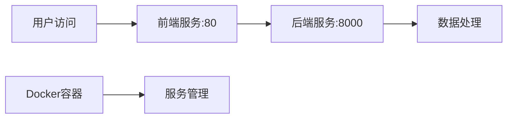

## Product Overview

将 FineSTEM 项目部署到腾讯云 Lighthouse 实例，包括环境配置、服务部署和访问验证

## Core Features

- 在 Lighthouse 实例(ap-beijing)上配置 Docker 环境
- 将 FineSTEM 项目部署到 /opt/fineSTEM 目录
- 使用 docker-compose 部署前后端服务
- 前端服务运行在端口 80
- 后端服务运行在端口 8000
- 确保部署完成后服务可正常访问

## Tech Stack

- 云服务器：腾讯云 Lighthouse (OpenCloudOS 系统)
- 容器化：Docker + Docker Compose
- 部署路径：/opt/fineSTEM
- 网络配置：前端端口80，后端端口8000

## 系统架构

```mermaid
graph TD
    A[Lighthouse实例] --> B[Docker环境]
    B --> C[Docker Compose]
    C --> D[前端服务:80]
    C --> E[后端服务:8000]
    F[项目文件] --> G[/opt/fineSTEM]
    G --> C
```

## 数据流



## Agent Extensions

### Integration

- **lighthouse** (from <integration>)
- Purpose: 连接和管理腾讯云 Lighthouse 实例，查询实例状态，执行部署操作
- Expected outcome: 成功连接到 Lighthouse 实例，完成项目部署和服务启动
- **tcb** (from <integration>)
- Purpose: 使用云开发服务辅助项目部署，提供数据库和存储支持
- Expected outcome: 确保项目依赖的云服务正常运行