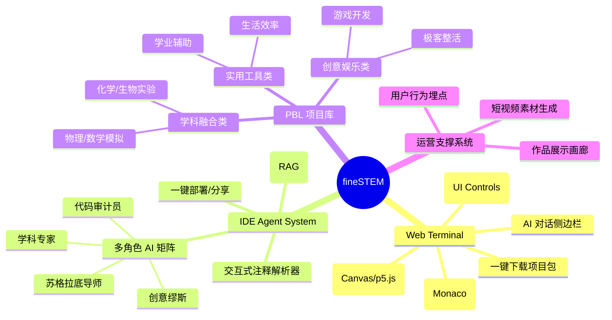

# 01. 产品架构与需求蓝图 (Product Architecture & Requirements Blueprint)

**编制者**: 需求设计专家智能体\
**日期**: 2025-12-07\
**版本**: v1.0

***

## 1. 宏观产品架构图 (Macro Architecture)

我们要构建的是一个\*\*“双轮驱动”\*\*的教育科技生态系统。

```mermaid
graph TD
    %% 用户入口层
    User[中学生用户] -->|观看短视频| Media[媒体矩阵 (抖音/B站)]
    User -->|搜索/推荐| Search[搜索引擎]

    %% 流量承接层 (The Hook)
    Media -->|点击链接/扫码| WebTerminal[Web自适应交互终端 (React App)]
    Search --> WebTerminal
    
    subgraph "Web Terminal (轻量级体验)"
        W_Preview[左侧: 实时画布]
        W_Chat[右侧: AI 引导对话]
        W_Code[隐形: 只读/参数修改代码]
    end

    %% 深度转化层 (The Core)
    WebTerminal -->|深度学习/下载项目| IDE_System[IDE 伴学系统 (VS Code/Trae)]
    
    subgraph "IDE Agent System (沉浸式PBL)"
        I_Plugin[伴学插件/配置包]
        I_Project[PBL 半成品项目包]
        
        subgraph "AI Agent 矩阵"
            A1[苏格拉底导师]
            A2[代码审计员]
            A3[创意缪斯]
            A4[学科专家]
        end
        
        I_Plugin --> A1 & A2 & A3 & A4
        I_Project -->|包含| Config[.trae/rules]
        I_Project -->|包含| Comments[交互式注释]
    end

    %% 内容/数据闭环
    IDE_System -->|产出作品| UGC[用户作品库]
    UGC -->|二创素材| Media
```

***

## 2. 核心场景故事 (User Stories)

### 场景一：从“刷视频”到“改参数” (The Hook)

* **用户**: 初二学生小明，正在为物理作业“平抛运动”头大。

* **触点**: 在 B 站刷到视频《别死记公式了，看我用代码把小球画出来》。

* **行动**: 点击视频下方的链接，打开 **Web 自适应终端**。

* **体验**:

  * 左边看到一个小球在做抛物线运动。

  * 右边 AI 说：“看，这就是重力 `g=9.8` 的效果。试着在下面输入框把 `9.8` 改成 `1.6`（月球重力），看看会发生什么？”

  * 小明修改参数，小球瞬间飞得更高更远。

  * AI 追问：“发现了吗？重力变小，物体在空中的时间变长了。这就是为什么宇航员在月球上能跳很高。”

* **结局**: 小明觉得物理变简单了，点击“下载完整项目”，想在自己电脑上玩。

### 场景二：IDE 里的“苏格拉底教学” (The Core)

* **用户**: 高一学生小红，下载了“Flappy Bird 换皮版”项目包。

* **行动**: 她想把小鸟换成班主任的照片，但替换图片后报错了。

* **交互**:

  * IDE 里的 **代码审计员 Agent** 弹出提示：“检测到图片路径错误。通常是因为文件名拼写不对，或者文件没放在 `assets` 文件夹里。”

  * 小红修正了路径，游戏跑起来了。

  * IDE 里的 **创意缪斯 Agent** 提示：“做得好！现在试试让小鸟每次跳跃时发出‘起飞’的声音？你可以问我怎么加。”

  * 小红询问代码，Agent 给出思路（而不是直接给代码），小红自己写了一行 `sound.play()`。

* **结局**: 小红不仅改了游戏，还学会了函数调用，并在朋友圈炫耀了自己的作品。

***

## 3. 详细功能需求 (Functional Specifications)

### 3.1 Web 自适应交互终端 (Web Adaptive Terminal)

* **布局设计**:

  * **PC端**: 左右分栏（左 60% 画布，右 40% 对话）。

  * **移动端**:

    * **方案A (默认)**: 上下分层（上 60% 画布，下 40% 对话区域），适合频繁交互场景。

    * **方案B (沉浸式)**: 全屏画布 + **悬浮对话气泡/抽屉 (Floating Drawer)**，点击唤起对话，适合展示为主的场景。

* **核心功能**:

  * **Live Preview**: 支持 HTML5 Canvas / p5.js / Python(Pyodide) 的实时渲染。

  * **Parameter Tuner**: 不直接暴露全代码，通过 UI 控件（滑块、输入框）修改关键变量。

  * **AI Chatbox**:

    * 预设 Prompt：基于当前项目上下文。

    * 状态感知：AI 能读取当前的变量值（如 `speed`, `gravity`）。

### 3.2 IDE 伴学系统 (IDE Agent System)

* **载体**: VS Code 插件 或 Trae 专用配置包。

* **核心功能**:

  * **Interactive Comments Parser**: 扫描代码中的 `// @ai-guide: {question}` 标记，当光标停留在该行时，自动激活 AI 侧边栏并提问。

  * **Contextual RAG**: 内置初高中物理/数学/编程知识库，回答问题时优先引用教科书概念。

  * **Multi-Persona Switcher**:

    * 遇到 Bug -> 切换 **代码审计员**。

    * 遇到闲聊/发呆 -> 切换 **创意缪斯**。

    * 遇到特定知识点 -> 切换 **学科专家**。

***

## 4. 预置 PBL 项目结构标准 (PBL Project Standard)

所有“半成品项目包”必须包含以下文件结构：

```text
project-name/
├── src/                  # 源代码
│   ├── main.py
│   └── physics.py        # 核心逻辑 (包含大量 Interactive Comments)
├── assets/               # 素材 (图片/声音)
├── .trae/
│   └── rules             # System Prompt 定义 (AI 人设)
├── .env.example          # 环境变量示例
├── README.md             # 学生阅读的“任务书”
└── guide.json            # 引导流程配置 (第一步做什么，第二步做什么)
```

***

## 5. 用户故事地图 (User Story Mapping)

### 5.1 骨架与发布计划

| 用户活动 (Backbone) | MVP (Sprint 1-2) | V1.0 (Sprint 3-4) | V2.0 (Future) |
| :-------------- | :--------------- | :---------------- | :------------ |
| **发现与进入**       | 观看短视频 -> 点击链接    | 搜索引擎 -> 官网        | 社区推荐 -> 个人主页  |
| **体验 Hook**     | Web 修改参数 -> 实时预览 | Web 简单代码编辑 -> 预览  | 移动端原生 App 体验  |
| **深度学习**        | 下载项目包 -> 本地运行    | IDE 插件引导 -> 修改代码  | 提交作品 -> 获得徽章  |
| **分享与反馈**       | 截图发朋友圈           | 生成作品海报            | 社区点赞/评论       |

### 5.2 详细故事卡片 (按角色)

#### 角色：学生 (Student)

* **Epic: 快速上手**

  * Story: 作为学生，我希望在 Web 端直接看到效果，而不需要安装环境。

  * Story: 作为学生，我希望通过拖动滑块就能改变物理现象。

* **Epic: 探索编程**

  * Story: 作为学生，我希望 IDE 能告诉我哪行代码控制了颜色。

  * Story: 作为学生，我希望能把游戏主角换成我自己的图片。

* **Epic: 获得成就**

  * Story: 作为学生，我希望做完项目后能生成一个可分享的链接。

#### 角色：家长 (Parent)

* **Epic: 监控与认可**

  * Story: 作为家长，我希望看到孩子是在学习物理，而不是纯玩游戏。

  * Story: 作为家长，我希望能收到孩子的“学习成果报告”。

***

## 6. 产品功能树 (Product Function Tree)



***

