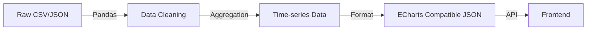

- version: v1.0.0
- created_at: 2025-12-07 00:00:00.000
- maintainer: AI Agent
- change_log:
  - 2025-12-07 00:00:00.000 初始创建：Track E 数据可视化详细设计。

# Track E Architecture: Data Visualization (Invisible to Visible)

## 1. 核心目标
将抽象的数据转化为具备情感冲击力的动态视觉内容。MVP 阶段聚焦于展现“规模感”和“时间流动感”。

## 2. 选题与数据源
**选题**: **"Code Never Sleeps" (代码永不眠)** - 展示全球编程语言/Github 提交的 24 小时热力变化或历年演变。

**数据源**:
*   **Source**: GitHub Archive (BigQuery) 或 Kaggle 上的 "GitHub Repositories / Languages" 数据集。
*   **Fallback**: 若实时抓取困难，使用 `Stack Overflow Developer Survey` 历年数据制作 Bar Racing Chart。

## 3. 技术实现细节

### 3.1 数据处理管线 (Python Backend)



*   **ETL 脚本**:
    *   使用 `Pandas` 读取 CSV。
    *   处理缺失值 (`fillna`)。
    *   按时间维度聚合 (Group by Year/Month)。
    *   转换为 ECharts 需要的 `dataset` 格式。

### 3.2 可视化引擎 (Frontend - ECharts)
*   **图表类型**:
    *   **Bar Racing (动态条形图)**: 展示排名变化（如：编程语言流行度 2000-2024）。
    *   **ThemeRiver (河流图)**: 展示不同类别的流量演变。
*   **配置重点**:
    *   `animationDuration`: 设置较长的动画时间，保证视频节奏平缓。
    *   `graphic`: 添加水印、背景图片、动态注解文本。

### 3.3 前端组件架构

```typescript
// Component Structure
<DataVizCanvas>
  <ChartContainer />    // ECharts 实例
  <TimeController />    // 播放/暂停/进度条
  <OverlayLayer />      // 叠加层 (用于显示关键事件，如 "2009: NodeJS Released")
</DataVizCanvas>
```

### 3.4 爬虫设计 (Optional for MVP)
*   如果需要实时数据（如今日 Trending Repo）：
    *   使用 `requests` 访问 GitHub Trending 页面。
    *   `BeautifulSoup` 解析 HTML 获取 Repo Name, Stars, Language。
    *   存入 SQLite 供前端展示。

## 4. 视频生产工作流
1.  **数据准备**: 运行 Python 脚本生成 `data.json`。
2.  **预览**: 在浏览器中加载页面，调整配色 (Dark Mode 更有科技感)。
3.  **录制**:
    *   设置 ECharts 动画时长为 60秒。
    *   使用屏幕录制工具录制全屏动画。
4.  **后期**: 加速/减速关键片段，配合背景音乐（快节奏电子乐）。

## 5. 开发任务清单
- [ ] 寻找并下载 Kaggle 数据集 (CSV)。
- [ ] 编写 Python 清洗脚本 (`scripts/etl_github_data.py`)。
- [ ] 初始化 React 页面并集成 `echarts-for-react`。
- [ ] 配置 Bar Racing 图表参数。
- [ ] 优化视觉样式 (字体、颜色、背景)。
- [ ] (可选) 编写简单的 FastAPI 接口提供 JSON 数据。
