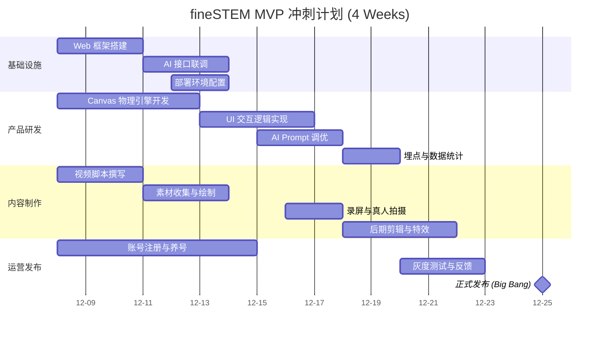
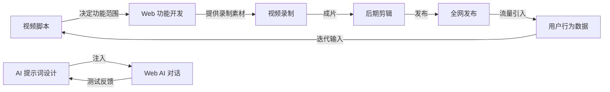

# 03. 项目执行与管理计划 (Project Execution & Management Plan)

**编制者**: 项目总经理智能体  
**日期**: 2025-12-07  
**版本**: v1.0  

---

## 1. 组织架构与角色职责 (Organizational Structure & Roles)

鉴于项目涉及研发、内容、运营跨界协作，我们采用 **Feature Team (特性小组)** 模式。

### 核心管理层
*   **项目总经理 (PGM)**: 负责战略方向、资源协调、进度把控。
*   **产品负责人 (PO)**: 负责需求定义、PBL 项目设计。
*   **技术负责人 (CTO)**: 负责 Web/IDE 架构选型、代码质量。
*   **内容负责人 (CMO)**: 负责短视频策划、流量增长。

### 职能分工矩阵 (RACI)

| 任务模块 | 谁负责 (R) | 谁批准 (A) | 谁咨询 (C) | 谁通知 (I) |
| :--- | :--- | :--- | :--- | :--- |
| **PBL 项目选题** | 产品/内容 | 总经理 | 技术 | 运营 |
| **Web 终端开发** | 前端开发 | 技术负责 | 产品 | 设计 |
| **IDE 插件开发** | 后端/插件 | 技术负责 | 产品 | - |
| **短视频制作** | 剪辑/编导 | 内容负责 | 产品 | 运营 |
| **社群运营** | 运营专员 | 内容负责 | 产品 | - |

---

## 2. 详细工作分解结构 (WBS - Phase 1 MVP)

**目标**: 上线“反重力实验室” Web 版 + 发布首支爆款视频。
**周期**: 4 周 (Sprint 1 - Sprint 2)

### Sprint 1: 基础设施与原型 (Week 1-2)
*   **1.1 产品设计**
    *   1.1.1 完成“反重力实验室”详细 PRD (UI/交互/逻辑)。
    *   1.1.2 编写 AI 引导对话脚本 (Prompt V1)。
*   **1.2 技术研发**
    *   1.2.1 搭建 Web 项目框架 (React + Tailwind)。
    *   1.2.2 实现 Canvas 物理引擎 (小球抛物线)。
    *   1.2.3 集成 LLM API，跑通对话流程。
*   **1.3 内容筹备**
    *   1.3.1 撰写《别死记公式》视频分镜脚本。
    *   1.3.2 准备拍摄素材 (课本插图、表情包)。

### Sprint 2: 交付与发布 (Week 3-4)
*   **2.1 产品完善**
    *   2.1.1 优化 UI 视觉 (大字号、高对比度)。
    *   2.1.2 埋点数据统计 (访问量、停留时长)。
    *   2.1.3 部署上线 (Vercel/Netlify)。
*   **2.2 视频制作**
    *   2.2.1 录制演示视频 (使用开发中的 Demo)。
    *   2.2.2 配音与剪辑。
    *   2.2.3 制作封面图。
*   **2.3 运营启动**
    *   2.3.1 注册抖音/B站/视频号官方账号。
    *   2.3.2 准备评论区话术和引流链接。

---

## 3. 里程碑规划 (Milestone Roadmap)

| 里程碑 | 时间节点 | 交付目标 | 成功标准 |
| :--- | :--- | :--- | :--- |
| **M1: MVP 冻结** | T+2周 | Web Demo 内部可运行，视频脚本定稿 | 内部评审通过，无重大 Bug |
| **M2: 灰度发布** | T+3周 | 视频样片完成，Web 端上线测试环境 | 邀请 10 位种子用户体验，NPS > 8 |
| **M3: 正式引爆** | T+4周 | 视频全网发布，Web 端正式开放 | 视频播放量 > 1w，Web 访问 > 1000 |
| **M4: IDE 启动** | T+6周 | IDE 插件原型完成，首个半成品包产出 | 跑通 IDE 伴学流程 |

---

## 4. 风险管理 (Risk Management)

*   **风险 1: AI 回答不可控 (幻觉)**
    *   *对策*: 在 System Prompt 中强行限制回答范围，对于不确定的问题回答“我还在学习中”。
*   **风险 2: 视频流量惨淡**
    *   *对策*: 准备 3 个不同风格的封面和标题进行 A/B 测试；准备 50 个马甲号在评论区引导。
*   **风险 3: Web 端高并发崩溃**
    *   *对策*: 前端静态化，API 接口增加限流，使用 Serverless 架构自动扩容。

---

## 5. 项目甘特图 (Project Gantt Chart)

---

## 6. 跨模块依赖关系图 (Dependency Graph)

---

## 7. 智能体协作机制 (Agent Collaboration)

我们引入三个核心智能体角色，通过明确的接口进行协作：

*   **需求设计专家 (Requirement Agent)**
    *   *输入*: 用户模糊需求、竞品分析。
    *   *输出*: PRD 文档、用户故事地图、Mermaid 流程图。
    *   *协作*: 向“项目总经理”提交变更申请。

*   **媒体工程管家 (Media Agent)**
    *   *输入*: PRD 文档、Web Demo。
    *   *输出*: 视频脚本、运营数据日报、视觉优化建议。
    *   *协作*: 向“项目总经理”汇报流量数据，向“需求专家”反馈用户痛点。

*   **项目总经理 (Manager Agent)**
    *   *输入*: 各方进度、风险报告。
    *   *输出*: 资源调配指令、里程碑确认、紧急熔断指令。
    *   *决策*: 拥有最高裁决权，特别是当“功能开发”与“视频发布时间”冲突时，通常优先保发布时间（砍功能）。
