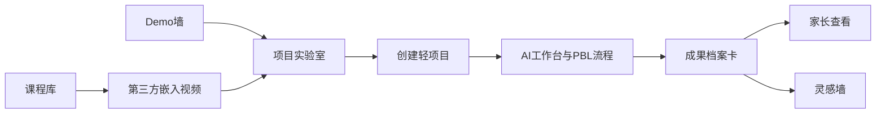
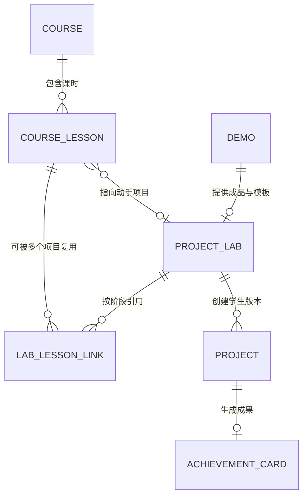

# fineSTEM MVP2 产品说明书：项目实验室与课程内容

version: v1.2.0
created_at: 2026-08-11 00:00:00.000  
maintainer: 产品经理 / 开发团队  
status: 已废弃，由Create AI导师方案替代
change_log:
  - 2026-08-11 00:00:00.000 初始创建：以项目实验室为核心，定义课程、第三方视频、PBL项目和家长成果层的关系。
  - 2026-08-11 00:00:00.000 需求收口：明确代码与内容双线推进，将首批课时拆分为项目专属内容和可复用公共知识胶囊，并补充公共课程骨架与集成交接门。
  - 2026-08-12 00:00:00.000 产品决策变更：现有Demo保存项目、项目详情和Create AI工作台已覆盖动手主链路，不再新增独立ProjectLab页面；本文件保留为决策历史，实施以08号文档为准。

> **废弃说明：** 不实施本文定义的独立 `ProjectLab`、`/labs/:slug`、`LabLessonLink` 和项目实验室后台。新的实施方案见《08_fineSTEM_MVP2_Create_AI导师增强产品说明书_V1.0.md》。课程、视频、家长成果等仍有价值的内容原则已迁移到新方案。

---

## 0. 执行摘要

MVP2 的核心不是营销系统、视频平台或线上社群，而是让 fineSTEM 自身更适合孩子独立完成 PBL 项目，并让家长不懂编程也能看懂孩子做了什么。

核心产品关系：

```text
项目是主线
视频是项目各阶段的学习支架
课程是视频与项目任务的编排
AI 是项目过程中的自助导师
成果档案卡是孩子与家长共同理解的结果
```

MVP2 采用两类内容入口：

1. **Demo 墙**让学生先看到成品、先试玩。
2. **课程库**让学生通过原创短视频理解一个项目或某个知识点。

无论从哪个入口进入，真正开始做项目时都进入统一的 **项目实验室**。



首个完整样板继续使用现有“文学知识卡”，运营课程名称暂定为：

> **AI+古诗：做一套会搜索的知识卡**

首个样板由两条工作线共同完成：

```text
A线：平台代码与内容承载能力
ProjectLab -> Course/CourseLesson -> LabLessonLink -> 视频嵌入 -> 工作台支架 -> 家长成果

B线：首批内容生产
项目冻结 -> 5条脚本与分镜 -> 录屏/动画 -> B站发布 -> 元数据回填 -> 联调验收
```

两条线不是完全独立。脚本、分镜和知识动画可以提前制作，涉及正式页面的操作录屏必须在首个项目主流程和界面文案冻结后进行。

---

## 1. 产品定位与边界

### 1.1 MVP2 一句话定义

> 面向 12-15 岁学生的自助式 STEM 项目实验室：通过 Demo、原创短视频和 AI 引导，完成一个可运行、可解释、可展示的 PBL 项目。

### 1.2 MVP2 要解决的问题

现有用户注册、登录、鉴权和个人项目归属功能已经完整存在。MVP2不重新开发用户系统，只验证并复用现有登录能力，确保用户从项目实验室登录后能回到原项目和挑战。

学生侧：

- 看见 Demo 后不知道怎样开始自己的版本。
- 视频看懂了，但没有紧接着动手的入口。
- 进入工作台后不知道第一步改哪里。
- 遇到错误容易放弃。
- 项目能运行，但不会解释自己做了什么。

家长侧：

- 不会编程，无法判断孩子是学习还是复制。
- 看不懂代码和技术报告。
- 不知道项目锻炼了什么能力。
- 不知道是否适合继续学习编程、AI或其他STEM方向。

内容侧：

- 课程库已有页签，但目前为空。
- 短视频、Demo和PBL项目没有统一内容结构。
- 视频发布在第三方平台后，fineSTEM缺少合适的嵌入和行动出口。
- 同一个项目还没有沉淀成可复制的视频课程模板。

### 1.3 明确不做

- 不开发自有视频上传、转码、分发和推荐平台。
- 不采集第三方视频播放率、播放进度或粉丝数据。
- 不建设UTM、外部渠道归因和营销漏斗。
- 不对接第三方视频平台账号体系。
- 不开发收费课程、订单、会员和直播课堂。
- 不建设学生群、私聊、开放评论和班级管理。
- 不建立家长编程课程或家长学习后台。
- 不要求运营者直接辅导孩子。
- 不用课程数量、视频播放量作为MVP2完成标准。

### 1.4 成功判断

MVP2成功的最低判断是：

1. 一个孩子能从Demo或课程进入项目实验室。
2. 孩子能理解项目目标并选择自己的改造方向。
3. 孩子能在AI引导下完成轻项目。
4. 孩子能生成一张有真实证据的成果档案卡。
5. 家长通过分享页能说明孩子完成了什么。
6. 第二个PBL项目可以复用同一套内容和产品结构。

---

## 2. 信息架构

### 2.1 探索中心三页签

| 页签 | 核心问题 | 主要内容 | 主动作 |
|------|----------|----------|--------|
| Demo墙 | 有什么好玩的项目？ | 可试玩成品、项目拆解 | 进入项目实验室 |
| 课程库 | 我怎样理解并完成它？ | 原创短视频课程、知识胶囊 | 观看课时 / 进入项目实验室 |
| 灵感墙 | 别人做出了什么版本？ | 学生成果档案卡 | 查看成果 / 我也做一个 |

三个页签不是三个互相独立的产品，而是围绕同一批PBL项目提供不同观看角度。

### 2.2 核心路由

| 路由 | 权限 | 用途 |
|------|------|------|
| `/explore?tab=demos` | 公开 | Demo发现与试玩 |
| `/explore?tab=courses` | 公开 | 原创短视频课程列表 |
| `/explore?tab=inspiration` | 公开 | 成果灵感墙 |
| `/explore/demos/:demoId` | 公开 | Demo体验、拆解、讲解和代码 |
| `/explore/courses/:slug` | 公开 | 课程详情与第三方视频嵌入 |
| `/labs/:slug` | 公开 | 项目实验室：目标、任务、挑战、家长说明 |
| `/create?project=:id&lab=:labId` | 登录 | 带项目实验室上下文进入工作台 |
| `/share/:token` | 公开 | 成果档案卡与家长摘要 |
| `/admin/project-labs` | 管理员 | 项目实验室内容管理 |
| `/admin/courses` | 管理员 | 课程和课时管理 |

### 2.3 内容实体关系



关系规则：

- 一个Demo最多对应一个主要项目实验室。
- 一个项目实验室可以没有课程，学生仍可直接动手。
- 项目课程通常关联一个项目实验室；公共知识课程可以不绑定单一项目。
- 一节课可以只讲知识，也可以直接指向某个项目步骤。
- 同一节公共知识课可以被多个项目实验室、多个PBL阶段引用。
- 项目实验室和课程下架后，不影响学生继续已有项目。

---

## 3. 用户模型

### 3.1 学生

| 维度 | MVP2定义 |
|------|----------|
| 年龄 | 首批12-15岁 |
| 基础 | 零基础到初级 |
| 设备 | 桌面或笔记本浏览器 |
| 目标 | 完成自己的项目版本，而不是先学完整语法体系 |
| 支持方式 | 视频、图文步骤、AI助手、固定自查 |

### 3.2 家长

家长不注册、不进入工作台、不需要学习编程。

家长只需要：

- 在项目实验室看到适合年龄、时长、设备和成果示例。
- 在分享页看到孩子改了什么、验证了什么、AI帮助了什么。
- 使用系统给出的3个问题与孩子交流。

### 3.3 内容管理员

管理员负责：

- 将已有Demo配置为项目实验室。
- 编写学生任务、家长说明和完成标准。
- 建立课程和课时。
- 填写第三方视频嵌入地址。
- 将课时映射到项目步骤或PBL阶段。
- 发布、下架和调整内容顺序。

---

## 4. 项目实验室

### 4.1 产品职责

项目实验室是从“看”进入“做”的核心页面。

它不承载完整代码开发环境，而是在创建个人项目之前完成：

- 看懂最终要做什么
- 判断项目是否适合自己
- 选择一个可完成的改造方向
- 了解最低完成标准
- 查看需要时可用的视频和知识内容
- 创建自己的轻项目

### 4.2 页面结构

```text
ProjectLabPage
├─ LabIdentity
│  ├─ 项目名称
│  ├─ 一句话挑战
│  ├─ 真实截图或短演示
│  └─ 开始我的版本
├─ LabFacts
│  ├─ 适合年龄
│  ├─ 预计时长
│  ├─ 所需设备
│  └─ 前置知识
├─ DemoPreview
│  ├─ 在线试玩
│  ├─ 截图/录屏
│  └─ 查看项目拆解
├─ LightProjectPath
│  ├─ Step 1 选择方向
│  ├─ Step 2 修改与运行
│  └─ Step 3 展示与解释
├─ ChallengeSelector
├─ RelatedCoursePanel
├─ ParentGuidePanel
├─ ExampleAchievement
└─ PrimaryAction
```

### 4.3 三档挑战

每个项目实验室至少提供三档任务：

| 档位 | 目标 | 典型改动 | 适合用户 |
|------|------|----------|----------|
| 轻松改 | 第一次运行成功 | 替换数据、标题、颜色、参数 | 零基础 |
| 进阶改 | 理解一个核心逻辑 | 增加筛选、统计、状态或规则 | 初级 |
| 创意改 | 做出明显不同版本 | 增加功能或改变使用场景 | 有兴趣深入 |

挑战不是三个独立项目，而是同一个模板的不同完成深度。

### 4.4 项目启动

匿名用户可浏览项目实验室和Demo。

点击“开始我的版本”时：

1. 选择或确认挑战。
2. 未登录用户进行轻注册。
3. 注册后回到原实验室继续，不跳首页。
4. 系统基于Demo最小模板创建轻项目。
5. 项目记录 `sourceLabId`、可选的 `sourceCourseId` 和 `sourceLessonId`，只用于恢复学习上下文，不用于营销追踪。
6. 工作台首条AI引导根据所选挑战生成。

### 4.5 工作台衔接

进入工作台后应固定显示：

- 当前项目实验室名称
- 当前挑战
- 当前轻项目步骤
- 这一步最低完成标准
- 相关视频或知识胶囊入口
- AI可以提供的帮助

AI上下文包含：

```text
labId
demoId
courseId?
lessonId?
selectedChallenge
currentStage
minimumCompletion
projectFilesSummary
```

视频不是强制前置条件。学生可以跳过视频直接做项目，也可以在卡住时返回相关课时。

### 4.6 项目实验室状态

| 状态 | 页面行为 |
|------|----------|
| 未发布 | 公共访问返回未发布页 |
| 已发布 | 正常浏览和创建项目 |
| Demo维护中 | 展示截图和录屏，暂时关闭在线试玩 |
| 没有关联课程 | 不展示课程区，不影响创建项目 |
| 已创建项目 | 主按钮为“继续我的项目” |
| 已完成项目 | 主按钮为“查看成果”，保留“再做一个版本” |

---

## 5. 课程库

### 5.1 产品职责

课程库是内容触达和学习支架，不是传统录播课程商城。

课程的核心单位不是“知识章节”，而是：

> 为完成一个PBL项目，在正确时机提供一段短视频、一个概念解释或一个操作示范。

### 5.2 课程类型

| 类型 | 说明 | 示例 |
|------|------|------|
| 项目课程 | 围绕一个完整项目组织 | AI+古诗知识卡 |
| 知识胶囊 | 解决项目中的一个知识点 | 数组是什么、LocalStorage是什么 |
| AI协作胶囊 | 教孩子正确使用AI完成项目 | 如何描述需求、怎样让AI解释错误 |
| STEM理解课 | 解释一个模型、实验或数据方法 | 用代码看抛物线、怎样读图表 |
| 家长说明 | 帮家长理解项目学习证据 | 怎样判断不是AI代做 |

首批只需实现“项目课程”和“知识胶囊”，其他类型使用同一模型预留。

公共知识课与项目课程的区别：

| 类型 | 是否绑定单一项目 | 内容目标 | 复用方式 |
|------|------------------|----------|----------|
| 项目课程 | 通常绑定 | 帮孩子完成具体项目 | 随项目实验室出现 |
| 公共知识课 | 不绑定 | 教编程、算法、AI的可迁移知识 | 多个项目按阶段引用 |

公共知识课不是脱离项目的长体系课。每个知识点仍至少提供一个fineSTEM项目中的实际例子和一个可操作练习。

首个样板的5条内容不全部归属于古诗项目课程：

| 内容归属 | 首批课时 | 后续用途 |
|----------|----------|----------|
| 项目专属课时 | V01项目认识、V02第一次修改、V05验收与成果 | 服务“古诗知识卡”的具体行动和页面操作 |
| 公共编程胶囊 | V03数据、数组与卡片渲染 | 可被问答测验、人物卡、数据展示等项目复用 |
| 公共AI胶囊 | V04让AI解释第一条错误 | 可被所有编程类项目在报错时复用 |

项目实验室通过 `LabLessonLink` 将3条项目专属课时和2条公共胶囊编排为一条连续的5段学习路径。课程库中仍按内容归属展示，避免把公共课复制进每一门项目课程。

### 5.3 课程库列表

现有 `/explore?tab=courses` 页面改造要求：

- 匿名用户可读取所有已发布课程。
- 不以登录状态为条件请求课程。
- 首批没有课程时显示说明空态，不显示大面积空白。
- 课程卡使用真实项目封面，不使用装饰性渐变占位。
- 点击课程卡进入课程详情。

课程卡展示：

- 课程名称
- 一句话产出
- 课程类型
- 适合年龄
- 预计总时长
- 课时数量
- 关联项目
- 难度

### 5.4 课程详情

```text
CourseDetailPage
├─ CourseIdentity
├─ CourseFacts
├─ LessonPlaylist
├─ EmbeddedVideo
├─ LessonTextSummary
├─ LinkedProjectAction
├─ RelatedKnowledgeCapsules
└─ ParentNote（仅家长说明类课程需要）
```

课程详情主动作根据课时类型变化：

| 课时类型 | 主动作 |
|----------|--------|
| 项目介绍 | 进入项目实验室 |
| 项目步骤 | 继续我的项目 / 创建项目 |
| 知识胶囊 | 返回项目当前步骤 |
| AI协作胶囊 | 带推荐提问进入AI工作台 |
| 家长说明 | 查看示例成果卡 |

### 5.5 第三方视频嵌入

视频统一发布到第三方平台，fineSTEM只保存展示所需信息：

```text
CourseLesson {
  id: string
  courseId: string
  title: string
  summary: string
  lessonType: "project" | "knowledge" | "ai" | "stem" | "parent"
  videoPlatform: "bilibili" | "other"
  externalVideoId: string?
  embedUrl: string
  externalUrl: string?
  posterUrl: string?
  transcript: string?
  durationSeconds: int?
  linkedLabId: string?
  linkedDemoId: string?
  linkedPblStage: string?
  conceptTags: string[]
  reusable: boolean
  recommendedPrompt: string?
  sortOrder: int
  status: "draft" | "published" | "archived"
}
```

要求：

- 不保存播放进度和播放率。
- 不通过第三方API同步账号、评论、粉丝和统计数据。
- 使用允许列表校验嵌入域名。
- iframe使用最小权限、明确标题和全屏属性。
- 嵌入失败时显示封面、文字摘要和“到第三方平台观看”。
- 每节视频必须有文字摘要，重要内容提供字幕或文字稿。
- 外部视频下架不能阻断项目实验室和项目继续使用。

### 5.6 LabLessonLink：跨项目复用

新增映射实体，避免把公共知识课复制到每个项目：

```text
LabLessonLink {
  id: string
  labId: string
  lessonId: string
  linkedPblStage: string
  trigger: "always" | "on_enter" | "on_error" | "on_complete"
  label: string
  required: boolean
  sortOrder: int
}
```

示例：

- 《数组：很多张卡片怎样装进一个列表》同时用于古诗知识卡、问答测验和数据展示项目。
- 《让AI读懂第一条报错》可用于所有编程项目的执行阶段。
- 《排序算法是在做什么》可用于智能待办、排行榜和数据分析项目。

### 5.7 与Demo现有讲解功能的边界

Demo页已经有项目拆解、讲解文档和代码页签，MVP2保留并继续使用，不在课程中重复生产同一内容。

| 内容位置 | 回答的问题 | 内容特点 |
|----------|------------|----------|
| Demo项目拆解 | 这个成品由哪些部分组成？ | 项目专属、结构化概览 |
| Demo讲解文档 | 这个项目的关键代码和设计为什么这样写？ | 项目专属、较完整、可阅读 |
| 项目课程 | 我怎样一步步做出自己的版本？ | 行动导向、按PBL过程组织 |
| 公共知识课 | 数组、搜索、排序、模型等知识能用于哪里？ | 跨项目复用 |
| AI讲解回顾 | 我当前这份代码哪里需要理解？ | 个性化、随项目沉淀 |

课程详情应优先链接Demo已有讲解，而不是把讲解文档重新录制成一套逐行朗读视频。

---

## 6. 以PBL项目规划课程

### 6.1 核心原则

课程不是先讲完知识再做项目，而是围绕项目中的行动组织：

```text
先看见结果
→ 选择自己的方向
→ 为当前步骤补一点知识
→ 立刻修改和运行
→ 遇错时学习调试
→ 用证据解释和展示
```

### 6.2 轻项目课程映射

| 轻项目步骤 | 学生要完成的行动 | 视频内容职责 |
|------------|------------------|--------------|
| Step 1 想法与方向 | 选择主题和最低目标 | 展示成品、给出变体、帮助缩小范围 |
| Step 2 设计与实现 | 修改数据、逻辑或界面并运行 | 演示关键改动、解释一个核心原理、展示调试 |
| Step 3 展示与反思 | 验证结果、截图、说明自己的工作 | 教孩子测试、解释AI帮助、生成成果卡 |

### 6.3 标准9阶段课程映射

| PBL阶段 | 视频要回答的问题 | 课程产出 |
|---------|------------------|----------|
| stage_00 初始化 | 如何开始这个项目？ | 环境与项目入口说明 |
| stage_01 脑爆 | 这个项目还能变成什么？ | 3-5个变体案例 |
| stage_02 开题 | 我要解决什么问题？ | 一句话目标与使用者 |
| stage_03 范围 | 第一版哪些不做？ | MVP裁剪示范 |
| stage_04 轨道 | 用什么方式实现？ | 技术路线的直观比较 |
| stage_05 设计 | 数据、页面和交互怎样组织？ | 结构图或纸面草图 |
| stage_06 计划 | 先做什么、后做什么？ | 3-5个执行步骤 |
| stage_07 执行 | 怎样实现、调试和验证？ | 多个短视频和知识胶囊 |
| stage_08 展示 | 怎样证明项目真的完成？ | 测试、反思和成果卡 |

不是每个项目都必须制作9条视频。轻项目可以压缩成4-6条；复杂标准项目再按阶段扩充。

### 6.4 知识胶囊的触发方式

知识胶囊不强制按顺序学习，出现在最需要的位置：

- 视频课时旁
- 项目实验室相关内容区
- 工作台当前步骤
- AI回答后的“进一步理解”入口
- 讲解文档中的关联链接

例如：

```text
孩子正在修改诗词数组
→ 系统推荐《数组：把很多张卡片装进一个列表》

孩子正在做收藏功能
→ 系统推荐《状态：为什么点一下星星会变化》

孩子遇到JavaScript报错
→ 系统推荐《让AI帮你读懂第一条错误》
```

### 6.5 公共知识课程骨架

公共课程不是一次性录完的大课，而是随着样板项目逐步积累的三条知识主线。每个胶囊只讲一个可迁移概念，并至少被一个真实项目调用。

#### 编程基础

| 层级 | 概念 | 首个可承载项目 |
|------|------|----------------|
| P0 | 变量与参数、数组与对象、条件判断 | 古诗知识卡、问答测验 |
| P1 | 循环、函数、事件与状态 | 随机抽题、收藏筛选、智能待办 |
| P2 | 本地存储、API与异步数据 | 个人收藏、天气或公开数据项目 |

#### 算法思维

| 层级 | 概念 | 首个可承载项目 |
|------|------|----------------|
| P0 | 问题分解、搜索与筛选、规则步骤 | 古诗搜索、任务筛选 |
| P1 | 排序、计分规则、随机与模拟 | 排行榜、测验评分、概率实验 |
| P2 | 复杂度直觉、方案比较与优化 | 大数据列表、路线或组合项目 |

#### AI素养

| 层级 | 概念 | 首个可承载项目 |
|------|------|----------------|
| P0 | 输入-模型-输出、清楚描述需求、报错解释与结果核验 | 所有AI辅助项目 |
| P1 | 幻觉、证据核查、训练与推理的区别 | 知识问答、内容生成项目 |
| P2 | 数据隐私、偏差、适用边界 | 调查分析、推荐或分类项目 |

内容建设顺序遵循“项目用到才生产”。不为了补齐目录提前制作暂时没有项目承载的知识点。

---

## 7. 家长理解层

### 7.1 项目实验室家长说明

每个项目实验室提供一块可折叠的“给家长看”区域：

- 孩子最终会做出什么
- 预计需要多久
- 是否需要家长陪伴
- 孩子会进行哪些真实操作
- 家长不需要做什么
- 可以问孩子哪三个问题

建议固定问题：

1. 你把原来的项目改成了什么？
2. 哪一次运行没有成功，你后来怎么处理？
3. 哪部分是AI帮助的，哪部分是你自己决定的？

### 7.2 成果档案卡家长摘要

成果卡新增：

```text
ParentSummary {
  completedWhat: string
  changedWhat: string[]
  testedWhat: string[]
  explainedWhat: string[]
  aiAssistance: string
  suggestedQuestions: string[]
}
```

生成依据：

- Demo来源与选择的挑战
- 代码或内容改动摘要
- 运行、截图和阶段证据
- 学生自己的反思
- 已保存的AI讲解文档

生成规则：

- 没有证据的能力不写。
- 明确区分学生决定和AI协助。
- 不展示聊天原文和完整代码。
- 不显示真实姓名、邮箱和学校。
- 分享链接不要求家长登录。

### 7.3 家长视频

家长视频不是必需的课程前置条件。它可以作为课程库中的“家长说明”类型内容，也可以嵌入项目实验室家长区域。

首条家长视频只解决一个问题：

> 不懂编程，怎样从改动、运行、解释和反思判断孩子真的完成了项目。

---

## 8. 数据模型

### 8.1 ProjectLab

```text
ProjectLab {
  id: string
  slug: string unique
  title: string
  subtitle: string
  demoId: string
  coverUrl: string?
  gradeRange: string
  estimatedMinutes: int
  prerequisite: string
  deviceRequirement: string
  learningGoals: string[]
  minimumCompletion: string[]
  lightSteps: LabStep[]
  challenges: LabChallenge[]
  parentGuide: ParentGuide
  exampleAchievementId: string?
  status: "draft" | "published" | "archived"
  sortOrder: int
  publishedAt: timestamp?
  createdBy: string
  createdAt: timestamp
  updatedAt: timestamp
}
```

### 8.2 Course

扩展当前 `CourseModel`：

```text
Course {
  id: string
  slug: string unique
  title: string
  summary: string
  courseType: "project" | "knowledge" | "ai" | "stem" | "parent"
  coverUrl: string?
  subject: string
  difficulty: string
  tags: string[]
  gradeRange: string
  estimatedMinutes: int
  primaryLabId: string?
  learningGoals: string[]
  status: "draft" | "published" | "archived"
  sortOrder: int
  publishedAt: timestamp?
  createdBy: string
  createdAt: timestamp
  updatedAt: timestamp
}
```

### 8.3 Project学习上下文

Project新增可选字段：

```text
sourceLabId: string?
sourceCourseId: string?
sourceLessonId: string?
selectedChallengeId: string?
```

这些字段只服务于：

- 恢复原项目实验室和课时
- 给AI提供正确项目上下文
- 在项目详情显示“相关课程”

不用于外部营销归因。

---

## 9. API草案

### 9.1 公开接口

| 方法 | 路径 | 用途 |
|------|------|------|
| GET | `/api/v1/project-labs` | 获取已发布项目实验室列表 |
| GET | `/api/v1/project-labs/{slug}` | 获取实验室、Demo摘要和相关课程 |
| GET | `/api/v1/courses` | 匿名获取已发布课程 |
| GET | `/api/v1/courses/{slug}` | 获取课程和已发布课时 |

### 9.2 登录接口

| 方法 | 路径 | 用途 |
|------|------|------|
| POST | `/api/v1/project-labs/{id}/start` | 创建或继续该实验室项目 |
| POST | `/api/v1/projects/{id}/select-challenge` | 保存挑战选择 |
| POST | `/api/v1/projects/{id}/lab-step/{step}/complete` | 保存轻项目步骤完成状态 |

### 9.3 管理接口

| 方法 | 路径 | 用途 |
|------|------|------|
| GET/POST | `/api/v1/admin/project-labs` | 实验室列表和新建 |
| PATCH | `/api/v1/admin/project-labs/{id}` | 编辑实验室 |
| POST | `/api/v1/admin/project-labs/{id}/publish` | 发布实验室 |
| GET/POST | `/api/v1/admin/courses` | 课程列表和新建 |
| PATCH | `/api/v1/admin/courses/{id}` | 编辑课程 |
| POST | `/api/v1/admin/courses/{id}/lessons` | 新建课时 |
| PATCH | `/api/v1/admin/course-lessons/{id}` | 编辑课时 |
| POST | `/api/v1/admin/project-labs/{id}/lesson-links` | 将项目或公共课时编排到实验室阶段 |
| PATCH | `/api/v1/admin/lab-lesson-links/{id}` | 调整触发条件、标签和顺序 |
| POST | `/api/v1/admin/courses/{id}/publish` | 发布课程 |

---

## 10. UI与交互规格

### 10.1 项目实验室布局

- 首屏展示真实项目画面、名称、年龄、时长和“开始我的版本”。
- 不使用大面积营销Hero和装饰卡片。
- 任务、挑战和课程是后续全宽内容区。
- 家长说明默认收起，但入口清楚。
- 已有项目时主按钮直接继续，不重复创建。

### 10.2 课程库布局

- 手机单列、平板双列、桌面三列。
- 卡片高度稳定，封面使用16:9真实项目画面。
- 标题、摘要、年龄、时长和课时数不得溢出。
- 空态显示“原创课程正在准备中”和“先去试玩Demo”。
- 课程卡只有一个主动作“查看课程”。

### 10.3 视频嵌入组件

```text
ExternalVideoEmbed
├─ poster/loading
├─ allowlisted iframe
├─ title
├─ text summary
├─ transcript toggle
├─ open external platform
└─ fallback state
```

要求：

- 不自动播放。
- 不在列表页加载播放器。
- 不因视频加载失败改变页面主要布局。
- 支持键盘焦点和有效标题。
- 遵守 `prefers-reduced-motion`。
- iframe来源不在允许列表时拒绝渲染。

### 10.4 响应式行为

| 视口 | 项目实验室 | 课程详情 |
|------|------------|----------|
| 小于768px | 单栏；底部固定主动作；提示用电脑完成更佳 | 视频在上，课时列表在下 |
| 768-1199px | 单栏主内容，事实和挑战可双列 | 视频与课时仍上下排列 |
| 1200px及以上 | 项目预览与任务摘要双栏 | 视频主区 + 课时侧栏 |

### 10.5 无障碍

- 视频必须有文字摘要，核心课程应有字幕或文字稿。
- 所有按钮可键盘操作，焦点清晰。
- 颜色不是挑战难度和完成状态的唯一信息。
- iframe提供可读标题。
- 封面、截图和成果图提供替代文本。
- 表单错误与字段建立程序化关联。

---

## 11. 当前代码差距

| 编号 | 当前状态 | 代码表现 | MVP2改造 |
|------|----------|----------|----------|
| G01 | 缺失 | 没有项目实验室实体和路由 | 新增ProjectLab模型、API和页面 |
| G02 | 部分具备 | Demo详情支持试玩、拆解、讲解和Fork | 增加“进入项目实验室”并传递上下文 |
| G03 | 部分具备 | `demo_video_url`已存储 | Demo详情尚未真实展示视频 |
| G04 | 部分具备 | 探索中心已有课程页签 | 当前页面为空且课程卡无详情动作 |
| G05 | 缺失 | Course API要求登录并按owner返回 | 改为匿名公开读、管理员写 |
| G06 | 缺失 | Course字段过少 | 扩展课程并新增CourseLesson |
| G07 | 缺失 | 无第三方视频安全嵌入组件 | 新增B站等允许列表嵌入与回退 |
| G08 | 部分具备 | Demo可创建轻项目 | 扩展为Lab/Course/Lesson上下文创建 |
| G09 | 部分具备 | AI有Demo和项目上下文 | 增加挑战、相关课时和最低完成标准 |
| G10 | 部分具备 | 成果分享页存在 | 增加家长摘要和证据约束 |
| G11 | 缺失 | 无项目实验室和课程后台 | 新增管理员内容维护页面 |
| G12 | 缺失 | 公共知识课无法按阶段复用到多个项目 | 新增LabLessonLink模型、接口与管理能力 |

主要涉及：

```text
apps/backend/app/db/models.py
apps/backend/app/db/migrations/versions/
apps/backend/app/schemas/
apps/backend/app/repositories/
apps/backend/app/api/project_labs.py
apps/backend/app/api/courses.py
apps/backend/app/api/projects.py
apps/backend/app/api/achievement_cards.py
apps/backend/main.py
apps/frontend/src/App.tsx
apps/frontend/src/types/index.ts
apps/frontend/src/services/api.ts
apps/frontend/src/pages/Explore.tsx
apps/frontend/src/pages/ExploreDemoDetail.tsx
apps/frontend/src/pages/ProjectLab.tsx
apps/frontend/src/pages/CourseDetail.tsx
apps/frontend/src/pages/Create.tsx
apps/frontend/src/pages/SharedAchievement.tsx
apps/frontend/src/components/course/
apps/frontend/src/components/project-lab/
```

---

## 12. 工程任务分解

规模：`S`约0.5-1人日，`M`约1-3人日，`L`约3-5人日，仅用于排序。

| 任务 | 优先级 | 规模 | 依赖 | 结果 |
|------|--------|------|------|------|
| BE-01 ProjectLab模型与迁移 | P0 | M | 无 | 实验室可存储和关联Demo |
| BE-02 ProjectLab公开与管理API | P0 | M | BE-01 | 可发布、查询和下架 |
| BE-03 Course扩展与CourseLesson迁移 | P0 | M | 无 | 可保存课程和第三方视频课时 |
| BE-04 Course公开与管理API | P0 | M | BE-03 | 匿名公开读、管理员写 |
| BE-05 LabLessonLink模型、接口与查询 | P0 | M | BE-01、BE-03 | 公共课时可被多个实验室按阶段复用 |
| BE-06 Lab启动项目与上下文字段 | P0 | M | BE-01 | 创建/继续项目并保留学习上下文 |
| BE-07 AI上下文扩展 | P0 | M | BE-05、BE-06 | AI知道挑战、步骤和相关课时 |
| BE-08 成果卡家长摘要 | P0 | M | BE-06 | 分享页能展示家长摘要 |
| FE-01 ProjectLab公开页面 | P0 | L | BE-02 | 从Demo或课程进入实验室 |
| FE-02 课程库匿名列表与课程卡 | P0 | M | BE-04 | 空页出现正式课程入口 |
| FE-03 CourseDetail课程详情 | P0 | L | BE-04 | 展示课时和关联项目 |
| FE-04 ExternalVideoEmbed组件 | P0 | M | FE-03 | 安全嵌入B站视频并有回退 |
| FE-05 Demo详情进入实验室 | P0 | S | FE-01 | Demo不直接跳空白项目 |
| FE-06 复用既有登录并恢复实验室动作 | P0 | M | FE-01、BE-06 | 不改认证体系，登录后继续原挑战 |
| FE-07 工作台课程支架 | P0 | M | BE-05、BE-07 | 当前步骤可返回项目课时或公共胶囊 |
| FE-08 分享页家长摘要 | P0 | S | BE-08 | 家长无需登录即可看懂 |
| FE-09 项目实验室管理页 | P1 | L | BE-02、BE-05 | 管理实验室内容及课时阶段映射 |
| FE-10 课程与课时管理页 | P1 | L | BE-04 | 管理第三方视频与排序 |
| QA-01 后端模型/API测试 | P0 | M | BE任务 | 权限、发布、上下文测试 |
| QA-02 前端组件测试 | P0 | M | FE任务 | 页面状态和嵌入回退测试 |
| QA-03 登录与上下文恢复回归测试 | P0 | S | BE-06、FE-06 | 验证既有登录能力未被改造破坏 |
| QA-04 完整E2E | P0 | M | 全部P0 | Demo/课程到成果完整验证 |
| CONTENT-01 首个项目实验室 | P0 | S | BE-02、FE-01 | 文学知识卡实验室数据 |
| CONTENT-02 首门项目课程 | P0 | M | BE-04、FE-03 | 古诗知识卡课时数据 |

### 12.1 推荐实施顺序

```text
第一纵切：ProjectLab模型/API -> 实验室页面 -> 从Demo进入 -> 创建轻项目
第二纵切：Course/CourseLesson/LabLessonLink -> 课程库 -> 课程详情 -> 嵌入第三方视频
第三纵切：项目与公共课时编排 -> AI工作台 -> 当前阶段相关课时
第四纵切：成果家长摘要 -> 分享页
最后：管理员页面和第二项目复制
```

第一纵切完成后，即使课程视频尚未制作，孩子也可以先从Demo进入项目实验室完成项目。

### 12.2 双线工作与集成交接门

| 阶段 | A线：代码/产品 | B线：视频/课程内容 | 交接结果 |
|------|---------------|--------------------|----------|
| Gate 1 内容契约冻结 | 冻结路由、按钮文案、课时字段、挑战和成果字段 | 完成5条脚本、分镜和镜头清单 | 视频脚本与正式产品逐项对应 |
| Gate 2 可录制版本 | 首个项目从Demo到成果可完整运行，阻塞问题清零 | 使用正式版本完成录屏和概念动画 | 获得可剪辑正式素材 |
| Gate 3 视频回填联调 | 支持B站嵌入、失败回退和LabLessonLink | 发布5条视频，提交封面、字幕、摘要和嵌入地址 | 课程库、实验室和工作台均能触达内容 |
| Gate 4 自助盲走 | 修复链路和可用性问题 | 校正视频中过时或不清楚的步骤 | 零人工辅导完成首个样板 |

依赖规则：

- B线可以立即开始选题、脚本、分镜、旁白和公共知识动画。
- B线不能在Gate 1和Gate 2通过前录制最终界面操作素材。
- A线不能等待全部视频完成后才开发课程承载；可以先使用占位课时和测试嵌入地址联调。
- 两条线在Gate 3合流，之后以完整用户路径验收，不再分别验收“代码完成”或“视频完成”。

---

## 13. 核心验收流程

### 13.1 Demo入口

1. 匿名用户浏览文学知识卡Demo。
2. 用户点击“进入项目实验室”。
3. 实验室展示目标、年龄、时长、三档挑战和家长说明。
4. 用户选择“轻松改”并注册。
5. 注册后自动创建项目并进入工作台。
6. AI首条消息指导替换第一首诗或标题。
7. 用户完成项目并生成成果卡。
8. 分享页展示家长摘要。

### 13.2 课程入口

1. 匿名用户进入课程库。
2. 用户打开《AI+古诗：做一套会搜索的知识卡》。
3. 页面嵌入第三方课时视频，同时提供文字摘要。
4. 用户点击“进入项目实验室”。
5. 后续流程与Demo入口完全一致。
6. 项目详情可返回原课程和相关课时。

### 13.3 异常流程

- 视频失效时仍可进入项目实验室。
- Demo在线体验失效时仍可用截图和最小模板开始。
- 项目没有课程时仍可完成。
- 注册失败时不丢失实验室和挑战选择。
- 重复点击开始不会重复创建同一实验室项目。
- 家长摘要生成失败时使用保守固定模板，不阻断分享。
- 下架课程或实验室后，已创建项目仍可继续。

---

## 14. 发布门禁

### 产品门禁

- [ ] 项目实验室页面可公开访问
- [ ] Demo和课程均可进入同一实验室
- [ ] 匿名注册恢复通过
- [ ] 轻项目可完成并生成成果卡
- [ ] 分享页家长摘要可用

### 课程门禁

- [ ] 至少一门项目课程已发布
- [ ] 至少三节学生课时可观看
- [ ] 每节视频有摘要，核心内容有字幕或文字稿
- [ ] 每节课至少有一个明确行动出口
- [ ] 视频失效不阻断项目流程

### 内容门禁

- [ ] 三档挑战已人工完整走通
- [ ] 视频操作与正式页面一致
- [ ] 最低完成标准真实可达
- [ ] 家长说明不夸大学习效果
- [ ] 第三方视频、图片、字体和音乐授权明确

### 明确不验收

- 视频播放量
- 视频完播率
- 外部平台粉丝增长
- 渠道转化率
- 课程付费率

---

## 15. MVP2完成定义

MVP2不是以“课程库不空”作为完成标志，也不是以“视频发布了”作为完成标志。

真正完成需要同时满足：

> 一个项目已经形成 Demo、项目实验室、原创短视频课程、AI自助PBL流程和家长可理解成果，并且第二个项目可以照同一模板复制。
