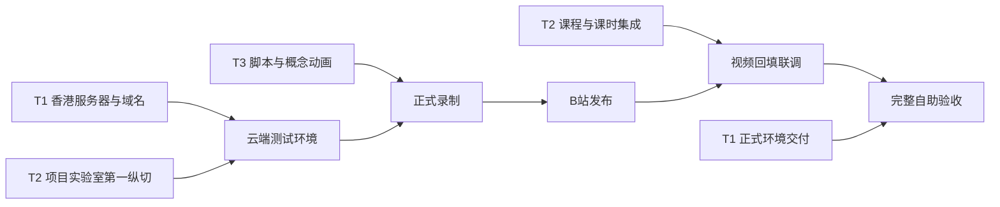

# fineSTEM MVP2 三大任务总体执行计划

version: v1.1.0  
created_at: 2026-08-11 00:00:00.000  
maintainer: 产品负责人 / 开发团队 / 内容策划  
status: 待执行  
change_log:
  - 2026-08-11 00:00:00.000 初始创建：统一规划域名与云端发布、MVP2代码开发、首个样板内容生产三大任务。
  - 2026-08-12 00:00:00.000 范围收口：部署确定为香港服务器、面向国际并交由独立Agent负责；删除机构服务与部署实施细节；细化MVP2代码开发任务。

---

## 0. 计划目标

本计划将fineSTEM当前阶段收口为三个必须共同完成的任务包：

| 任务 | 目标 | 完成标志 |
|------|------|----------|
| T1 域名注册与云端发布 | 将当前系统发布到香港服务器并提供正式国际域名 | 外部部署Agent交付可访问环境，MVP2完成接口联调与冒烟验证 |
| T2 MVP2代码开发 | 让项目实验室、课程库和PBL工作台形成完整产品链路 | Demo/课程可进入实验室，学生可完成项目，家长可看懂成果 |
| T3 内容执行 | 完成首个项目的5条学生短视频并嵌入fineSTEM | 视频发布到B站，项目内按阶段可触达，并完成零辅导盲走 |

三项任务的共同最终成果：

> 一个孩子能够从正式域名进入fineSTEM，试玩古诗知识卡Demo，按需要观看短视频，创建并修改自己的项目，使用AI理解和调试，生成家长可理解的成果档案卡。

---

## 1. 总体执行原则

### 1.1 三个任务可以并行，但有明确依赖



- T1由另一个Agent独立负责，当前计划只维护代码侧交接点。
- T2可以继续在本地开发，同时尽早部署一个云端测试环境。
- T3的脚本、分镜、旁白和公共动画立即开始。
- 正式操作录屏必须等待T2主流程和云端测试界面冻结。
- 正式开放前需要完成三条任务的集成冒烟和完整用户路径验证。

### 1.2 不以单项完成代替整体完成

- 买到域名不等于完成上线。
- 代码合并不等于孩子能够独立使用。
- 5条视频发布不等于课程已经进入项目流程。
- 三项任务必须在同一条真实用户路径中合流验收。

---

## 2. T1：域名注册与云端发布

### 2.1 当前边界

- 部署地区已确定为香港服务器，产品面向国际访问。
- 域名购买、服务器配置、容器、HTTPS、备份和运维实施由另一个Agent负责。
- 本MVP2计划不再展开部署技术方案，也不把部署任务混入产品代码排期。
- MVP2开发只需要向部署Agent提供明确的运行入口、环境变量、迁移命令和联调清单。

### 2.2 本计划保留的交接点

| 交接点 | 部署Agent提供 | MVP2开发提供 |
|--------|---------------|---------------|
| D1 测试环境 | 可访问的测试域名和服务地址 | 可构建的前端、可启动的后端、数据库迁移和测试数据 |
| D2 接口联调 | HTTPS环境、REST和WebSocket代理结果 | API基础路径、ZeroClaw地址配置方式、健康检查地址 |
| D3 内容录制 | 稳定的云端测试版本 | 冻结的页面、按钮和项目主流程 |
| D4 正式发布 | 正式国际域名和生产环境 | 已通过测试的MVP2版本及发布说明 |

T1在总体计划中只作为外部依赖跟踪，不由当前MVP2开发任务负责实施。

---

## 3. T2：MVP2代码与产品开发

### 3.1 当前代码基础

当前并非从零开发：

- 注册、登录、JWT、项目归属和登录提示已经存在。
- Demo详情已经支持试玩、拆解、讲解、代码和Fork。
- 轻项目3步、标准PBL 9阶段、AI工作台和成果分享页已经存在。
- 数据库已有简单 `courses` 表，探索中心也已有课程库页签。

但当前课程能力很薄：课程列表需要登录，只按创建者读取；没有发布状态、课程详情、课时、视频嵌入和项目阶段映射；课程卡按钮也没有进入详情的路由。当前还没有ProjectLab实体和页面。

### 3.2 P0-1：数据模型和迁移

| 开发项 | 主要字段/关系 | 用途 |
|--------|---------------|------|
| 新增 `ProjectLab` | slug、demoId、年龄、时长、目标、三档挑战、轻项目步骤、最低完成标准、家长说明、发布状态 | 保存项目实验室内容 |
| 扩展 `Course` | slug、课程类型、封面、年级、时长、学习目标、主要实验室、发布状态、排序 | 将现有私人资源表升级为公开课程实体 |
| 新增 `CourseLesson` | 标题、类型、B站ID/嵌入地址、封面、摘要、文字稿、概念标签、可复用标记、发布状态 | 保存5条视频及后续公共课 |
| 新增 `LabLessonLink` | labId、lessonId、PBL阶段、触发条件、标签、是否必需、排序 | 同一公共课时被多个项目复用 |
| 扩展 `Project` | sourceLabId、sourceCourseId、sourceLessonId、selectedChallengeId | 保存学生从哪里开始、当前做哪档挑战 |
| 扩展成果卡 | parentSummary JSON或等价字段 | 保存家长可读的改动、测试、解释和AI帮助摘要 |

所有结构变更使用Alembic迁移，并提供首个“古诗知识卡”实验室、课程和占位课时的初始化数据。

### 3.3 P0-2：后端接口

| 接口组 | 必须开发的能力 |
|--------|----------------|
| 项目实验室公开接口 | 获取已发布实验室列表和详情；详情包含Demo摘要、挑战、步骤和关联课时 |
| 课程公开接口 | 匿名读取已发布课程列表和课程详情；只返回已发布课时 |
| 实验室启动接口 | 登录后根据实验室和挑战创建或继续项目；重复点击不重复创建 |
| 项目上下文接口 | 保存挑战和当前轻项目步骤；读取与当前阶段有关的1-2条课时 |
| 成果摘要接口 | 根据项目证据和学生反思生成或保存家长摘要 |
| 最小管理接口 | 管理员创建、修改、发布实验室/课程/课时并维护课时映射 |

现有 `courses` 接口需要从“登录后按owner查询”改成“公开读、管理员写”，并从兼容层迁移到SQLAlchemy Repository。

### 3.4 P0-3：学生端页面

#### 项目实验室 `/labs/:slug`

- 真实Demo预览和最终成果说明。
- 年龄、预计时长、设备和前置知识。
- 轻松改、进阶改、创意改三档挑战。
- 三步项目路径和最低完成标准。
- 当前项目会用到的项目课时及公共知识胶囊。
- 可折叠家长说明。
- “开始我的版本”“继续我的项目”“查看成果”三种主状态。

#### 课程库 `/explore?tab=courses`

- 匿名加载已发布课程，不再因未登录显示空列表。
- 正式空态、真实封面、课程类型、年龄、时长和关联项目。
- 课程卡进入课程详情，不直接开始一个不存在的学习流程。

#### 课程详情 `/explore/courses/:slug`

- 课时列表和当前课时。
- B站嵌入播放器、文字摘要、文字稿和外部观看回退。
- 项目专属课时与公共胶囊的归属标识。
- 始终可见的“进入项目实验室”动作。

#### Demo详情衔接

- 有实验室的Demo将主动作改为“进入项目实验室”。
- 没有实验室的旧Demo继续保留原Fork逻辑，避免影响现有内容。
- Demo已有拆解、讲解文档和代码页签保持不变。

### 3.5 P0-4：创建与工作台衔接

- 登录提示保存 `lab`、挑战和返回地址，登录完成后恢复原动作。
- 根据Demo最小模板创建项目，同时写入来源实验室和挑战。
- `Create.tsx`只增加一个克制的“本步帮助”入口，不重做整个AI工作台。
- 帮助区展示当前步骤、最低完成标准和最多2条相关视频。
- AI请求上下文增加实验室、挑战、当前步骤和最低完成标准。
- 运行报错时可推荐V04；修改数组时可推荐V03；完成运行后推荐V05。
- 项目详情增加“返回项目实验室”“相关课程”和“继续项目”入口。

### 3.6 P0-5：第三方视频组件

新增统一的 `ExternalVideoEmbed`：

- 只允许配置过的B站或其他可信嵌入域名。
- 不自动播放，不记录播放率和播放进度。
- 有固定16:9尺寸、加载状态、iframe标题和全屏能力。
- 嵌入失败时显示封面、摘要和“到B站观看”。
- 外部视频下架时不阻断项目实验室和工作台。

### 3.7 P0-6：家长成果层

- 成果卡增加“完成了什么、改了什么、测试了什么、能够解释什么、AI帮助了什么”。
- 分享页以非技术语言展示摘要，不要求家长登录。
- 摘要只能使用已有项目证据，不凭空声称孩子掌握某项能力。
- 明确区分学生决定和AI协助，不展示聊天全文或完整代码。

### 3.8 P0-7：首个样板配置与测试

- 创建“我的古诗知识卡”ProjectLab数据。
- 创建项目课程及V01、V02、V05占位课时。
- 创建公共编程V03和公共AIV04，并通过 `LabLessonLink` 编排到古诗项目。
- 视频尚未发布时使用占位状态；获得B站地址后只更新内容数据。
- 后端测试覆盖公开/草稿权限、启动幂等、课时映射和成果摘要。
- 前端测试覆盖空态、播放器回退、登录恢复和按钮状态。
- E2E覆盖“Demo或课程 -> 实验室 -> 登录 -> 创建/继续 -> 工作台 -> 成果分享”。

### 3.9 P1：首个样板后再开发

| 后置项 | 后置原因 |
|--------|----------|
| 完整可视化内容管理后台 | 首个样板可先用初始化数据和最小管理接口，避免后台挤占学生链路时间 |
| 课程搜索、复杂筛选和推荐系统 | 首批内容量太少，没有真实需求 |
| 学习进度、完播率和观看统计 | 已明确不做视频平台运营数据 |
| 自有视频上传、转码和分发 | 视频由B站等第三方承载 |
| 班级、群聊、私信和教师管理 | 不属于当前产品模式 |

### 3.10 开发顺序

```text
纵切1：数据迁移 -> ProjectLab API/页面 -> Demo进入 -> 创建/继续项目
纵切2：Course/CourseLesson -> 匿名课程库 -> 课程详情 -> B站嵌入
纵切3：LabLessonLink -> 工作台本步帮助 -> AI上下文
纵切4：家长成果摘要 -> 分享页
纵切5：首个样板数据 -> 完整E2E -> 第二项目复用验证
```

### 3.11 既有功能处理原则

- 现有注册、登录、JWT和项目归属不重写。
- 只补充实验室上下文恢复和相关回归测试。
- 保留Demo页现有项目拆解、讲解文档和代码页签。
- 课程不重复录制Demo讲解文档，重点提供行动和公共知识。
- 不开发自有视频平台、播放率统计或外部账号同步。

### 3.12 T2验收门禁

- [ ] 匿名用户可浏览Demo、项目实验室和已发布课程
- [ ] 未登录用户选择挑战后登录，能够回到原实验室继续
- [ ] 同一实验室重复开始不会创建重复项目
- [ ] 项目课程和公共胶囊按当前阶段正确出现
- [ ] V03/V04只保存一次并可被第二项目引用
- [ ] B站视频失效时仍能阅读摘要并继续项目
- [ ] AI知道当前实验室、挑战、步骤和最低完成标准
- [ ] 成果分享页不要求家长登录且不暴露学生隐私
- [ ] 后端、前端和完整E2E测试通过

---

## 4. T3：首个样板内容执行

### 4.1 首批5条内容

| 视频 | 归属 | 主要形式 | 项目动作 |
|------|------|----------|----------|
| V01 这套古诗卡片是怎样做出来的 | 古诗项目专属 | Demo录屏与变体展示 | 试玩并选择挑战 |
| V02 只改三处，变成你的知识卡 | 古诗项目专属 | 正式工作台录屏与标注 | 修改标题、诗词和颜色 |
| V03 数组：数据怎样变成网页卡片 | 公共编程胶囊 | 数据流和代码追踪动画 | 修改数组中的一条数据 |
| V04 让AI帮你看懂第一条错误 | 公共AI胶囊 | 系统图、真实报错和核验 | 解释错误、再次运行并检查 |
| V05 怎样证明这是你完成的项目 | 古诗项目专属 | 成果生成录屏和证据标记 | 截图、反思并生成成果卡 |

### 4.2 每条视频交付物

- 脚本和分镜
- 旁白稿和字幕稿
- 正式视频文件
- 16:9封面
- 文字摘要和必要文字稿
- B站视频ID、外部地址和嵌入地址
- 关联项目、PBL阶段、触发条件和行动按钮
- 使用的图片、字体、音乐和素材授权记录

### 4.3 内容执行顺序

```text
冻结项目内容
→ 完成5条脚本和镜头清单
→ 建立公共视觉组件
→ 先做V03/V04概念动画
→ 等云端测试版和操作界面冻结
→ 集中录制V01/V02/V05及真实调试素材
→ 剪辑、字幕、封面
→ 上传B站
→ 回填fineSTEM并盲走验收
```

### 4.4 T3验收门禁

- [ ] 每条视频只解决一个主要问题
- [ ] 视频中的按钮、页面和正式环境一致
- [ ] 每条视频结尾都有一个fineSTEM项目动作
- [ ] V03/V04脱离古诗项目也能理解和复用
- [ ] 所有视频有字幕和文字摘要
- [ ] 视频失效不阻断项目
- [ ] 不以AI生成代替学生改动、运行、验证和解释
- [ ] 家长能从成果证据理解孩子完成了什么

---

## 5. 三任务集成交接门

| 门禁 | T1 域名/云端 | T2 代码 | T3 内容 | 结果 |
|------|-------------|---------|---------|------|
| Gate 0 范围确认 | 香港服务器和国际域名方案已交给部署Agent | P0/P1边界冻结 | 首个项目和5个选题冻结 | 三条任务使用同一目标 |
| Gate 1 内容契约冻结 | 提供预计域名、API和WS路径 | 挑战、按钮、课时和成果字段确定 | 5条脚本和镜头清单完成 | 开发和内容使用同一套名称 |
| Gate 2 云端可录制版本 | 提供稳定测试环境 | Demo到成果主路径可运行 | 旁白、分镜和动画模板就绪 | 开始正式屏幕录制 |
| Gate 3 视频回填联调 | 外部视频嵌入可访问 | 课程、LabLessonLink和工作台推荐可用 | 5条视频已上传，元数据齐全 | 内容在正确阶段被触达 |
| Gate 4 正式发布 | 香港正式环境和国际域名可用 | E2E、权限和回归测试通过 | 零辅导盲走通过 | 正式开放首个样板 |

---

## 6. 八周三线执行计划

| 周次 | T1 域名与云端 | T2 MVP2代码 | T3 内容执行 | 里程碑 |
|------|---------------|-------------|-------------|--------|
| 第1周 | 部署Agent确认香港服务器和国际域名方向 | 审计现有课程、Demo、Fork、工作台和成果代码；冻结数据模型 | 冻结古诗项目目标、挑战、最低成果和5个选题 | Gate 0完成 |
| 第2周 | 提供测试环境预期接口信息 | 完成迁移、ProjectLab API/页面、Demo入口和登录恢复 | 完成V01-V05脚本、分镜、旁白和镜头清单 | Gate 1完成 |
| 第3周 | 提供首个云端测试环境 | 完成Course、CourseLesson、LabLessonLink、匿名课程库和视频组件 | 建立视觉模板，制作V03/V04动画初稿 | 课程框架可访问 |
| 第4周 | 保持测试环境稳定供录制 | 跑通Demo到成果，完成工作台本步帮助和AI上下文 | 在稳定版本集中录制正式素材 | Gate 2完成 |
| 第5周 | 配合修正接口路径问题 | 完成家长摘要、首个样板数据和主要自动化测试 | 剪辑V01-V05，完成字幕、封面和摘要 | 5条待发布成片 |
| 第6周 | 提供正式环境候选 | 回填正式课程数据，完成前后端和视频联调 | 上传B站并提交全部视频信息 | Gate 3完成 |
| 第7周 | 配合完整路径冒烟 | 修复权限、状态、移动端和E2E问题 | 执行学生零辅导盲走和家长理解测试 | Gate 4候选 |
| 第8周 | 切换正式国际域名 | 发布首个项目实验室和课程 | 发布示例成果，整理第二项目复用清单 | MVP2正式样板上线 |

---

## 7. 每周推进方式

每周只维护一张三任务看板：

| 状态 | 定义 |
|------|------|
| 待开始 | 输入和负责人明确，可以进入执行 |
| 进行中 | 已有实际产物，不只是讨论 |
| 待联调 | 单任务完成，等待其他任务提供输入 |
| 阻塞 | 缺少部署环境、正式页面或视频地址 |
| 已完成 | 通过对应验收门禁 |

每周复盘只回答五个问题：

1. 三个任务本周分别产生了什么可检查产物？
2. 哪些页面或字段已冻结，可以开始录制？
3. 哪些内容已经可嵌入，哪些仍是占位？
4. 是否出现会阻止完整用户路径或发布的问题？
5. 下周唯一最重要的跨任务交付是什么？

---

## 8. 主要风险与回退

| 风险 | 影响 | 预防 | 回退 |
|------|------|------|------|
| 部署环境晚于开发计划 | 无法及时完成云端录制和联调 | 本地先完成P0纵切，提前提交部署交接清单 | 先在本地稳定版本录制非域名相关素材 |
| 部署接口路径与本地不一致 | REST、图片或WebSocket不可用 | Gate 1冻结API、资源和WS配置方式 | 使用环境变量适配，不在业务组件硬编码域名 |
| 视频录制后页面变化 | 返工和教学错位 | Gate 1/2后再录正式操作素材 | 更新文字说明；关键路径变化则重录 |
| 课程模型一次做得过大 | 首个样板延期 | P0只做公开课、课时、映射和最小管理接口 | 复杂后台、筛选和推荐移到P1 |
| `Create.tsx`改动范围过大 | AI主流程发生回归 | 只增加独立“本步帮助”组件和上下文参数 | 功能开关关闭帮助区，保留原工作台 |
| B站视频下架或禁止嵌入 | 课程内容不可播放 | 每节课有摘要、文字稿和外部链接回退 | 项目仍可继续，替换视频地址 |

---

## 9. 总完成定义

三大任务全部完成需要同时满足：

- 香港服务器和正式国际域名可访问。
- 部署Agent与MVP2代码完成接口联调和冒烟验证。
- 现有登录能力在生产环境通过回归验证。
- 项目实验室、课程库、公共课时复用和工作台支架上线。
- 首批5条视频发布到B站并嵌入正确项目阶段。
- 学生不依赖运营者直接辅导即可完成古诗知识卡项目。
- 家长不看代码也能理解孩子的改动、验证、反思和AI帮助。
- 第二个项目可以复用至少V03或V04及相同产品结构。

域名已购买、服务器能打开、代码已合并或视频已上传，均不能单独视为MVP2完成。
