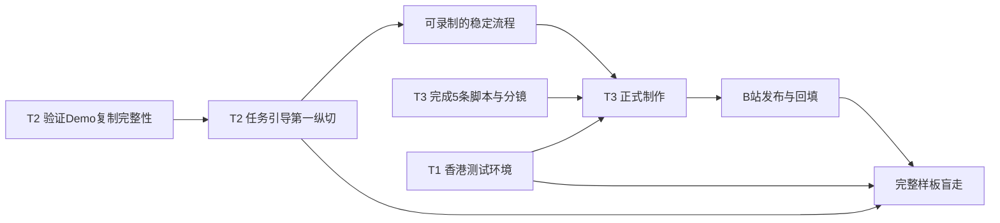

# fineSTEM MVP2 三大任务总体执行计划

version: v1.3.0
created_at: 2026-08-11 00:00:00.000
updated_at: 2026-08-12 00:00:00.000
maintainer: 产品负责人 / 开发团队 / 内容策划
status: 分析完成，待评审后执行
change_log:
  - 2026-08-11 00:00:00.000 初始创建：统一规划域名与云端发布、MVP2代码开发、首个样板内容生产三大任务。
  - 2026-08-12 00:00:00.000 范围收口：部署确定为香港服务器、面向国际并交由独立Agent负责；删除机构服务与部署实施细节。
  - 2026-08-12 00:00:00.000 产品主线校正：取消独立ProjectLab，代码开发转为Create中的复制项目任务引导。
  - 2026-08-12 00:00:00.000 MVP2边界冻结：数字人和语音后移到MVP3；MVP2只对Demo复制项目增加提醒、任务引导、完成验证、课程触达和家长成果摘要。

---

## 0. 总目标

当前阶段保留三大任务：

| 任务 | 本阶段目标 | 负责人边界 |
|------|------------|------------|
| T1 域名与云端 | 香港服务器、国际域名和可访问环境 | 由部署Agent负责，本计划只跟踪交接 |
| T2 MVP2代码 | 跑通“Demo复制 -> Create任务引导 -> 修改 -> 运行验证 -> 成果证据” | 当前产品和开发主线 |
| T3 内容执行 | 完成首个样板的5条短视频并上传B站、嵌回fineSTEM | 内容主线，与T2在样板项目合流 |

共同结果：

> 孩子从一个可玩的Demo出发，把它保存为自己的项目，在任务引导下完成真实修改和验证；需要时能看到短视频解释，最后形成家长看得懂的成果。

---

## 1. 范围边界

### MVP2做

- 复用现有Demo、项目详情、Create、Skill、教学模式、运行和成果卡。
- 只对Demo复制项目启用一次性提醒和可再次进入的任务引导。
- 让AI一次布置一项修改任务，并用真实运行结果验证。
- 完成首个项目5条短视频，按项目情境触达。
- 在现有成果卡中形成家长可理解摘要。

### MVP2不做

- 独立项目实验室页面和ProjectLab模型。
- 自有视频上传、转码、播放率和完播率统计。
- 与B站账号、评论、粉丝或营销数据强关联。
- 班级、机构、教师后台和收费课程。
- 数字人、AI朗读和语音输入。
- 对学生从零创建的项目强制注入复制项目引导。

### MVP3再评估

- 语音朗读与语音输入。
- 数字人或状态化导师形象。
- 更复杂的个性化推荐和长期学习路径。

---

## 2. 三任务依赖



关键依赖：

- T2首先验证Demo保存后是否真正复制了代码，否则任务引导和录屏都无法成立。
- T3的脚本、动画和旁白可以先做，正式操作录屏等待T2界面和云端测试环境稳定。
- T1由另一个Agent执行，本计划不展开服务器技术细节。
- 三条线最终必须通过同一条用户路径验收，不能分别宣布完成。

---

## 3. T1：域名与云端发布

### 3.1 当前边界

- 香港服务器。
- 面向国际访问。
- 域名、HTTPS、容器、备份和运维由部署Agent负责。
- 当前产品文档只维护应用交接条件。

### 3.2 交接清单

| 交接点 | 部署Agent提供 | MVP2开发提供 |
|--------|---------------|---------------|
| 测试环境 | 可访问测试域名和服务地址 | 可构建前端、可启动后端、迁移和测试数据 |
| API联调 | HTTPS、REST和WebSocket代理结果 | API基础路径、环境变量和健康检查地址 |
| 内容录制 | 稳定的云端测试版本 | 冻结的按钮、文案和完整项目路径 |
| 正式发布 | 正式域名和生产环境 | 已通过测试的MVP2版本和发布说明 |

---

## 4. T2：MVP2代码与产品开发

### 4.1 已有基础

- 注册、登录、项目归属已经完整。
- Demo详情已支持试玩、拆解、讲解、代码和保存项目。
- 项目详情可以恢复workspace并进入Create。
- Create已有AI对话、QuestionCard、编辑器、代码运行、项目文件、教学模式和代码讲解。
- 后端已有Skill状态、PBL门禁、代码读取、代码运行、证据和成果卡工具。
- `Project.from_demo_id` 可以识别Demo复制项目。

### 4.2 审计发现的前置问题

当前“保存到我的项目”首先需要验证两个问题：

1. 是否把Demo的Fork模板真实写入新项目workspace。
2. `mode: light` 的复制项目为什么仍可能使用标准项目的早期阶段，以及这会不会与代码教学门禁冲突。

如果第1项未满足，P0必须先修复复制完整性。

如果第2项未对齐，必须先定义“改造型轻项目”的Skill初始化规则，不能直接在所有项目上关闭阶段门禁。

### 4.3 产品方案

任务引导只对 `from_demo_id` 非空的项目生效：

```text
第一次进入Create
-> 显示一次提醒，不自动发送AI消息
-> 学生选择“开始任务引导”或“先自己看看”
-> 开始后AI读取Skill和真实代码
-> 只给一项修改任务和完成条件
-> 学生修改并运行
-> AI重新读取代码并运行验证
-> 通过后保存证据、解释一个知识点
-> 学生决定是否进入下一项
```

再次进入时不重复提醒，使用Create现有快捷区的“任务引导”入口。

### 4.4 与现有Skill的关系

- 不新增Tutor状态机、第五种教学模式或第二套项目流程。
- `guided / demo / hands_on / lecture` 继续决定AI怎样教。
- Skill继续管理阶段、工件、教学模式和证据。
- 引导层只管理首次提醒、当前一项任务和完成验证。
- 复制项目默认遵循动手式原则，但学生仍可切换现有四种模式。
- 标准项目的9阶段门禁不能被复制项目逻辑绕过。

### 4.5 P0开发任务

| 顺序 | 任务 | 完成标志 |
|------|------|----------|
| 1 | Demo复制完整性 | 新项目workspace包含来源Demo真实代码和文件 |
| 2 | 复制项目Skill初始化 | 改造型轻项目可直接进入修改循环，同时不影响标准9阶段 |
| 3 | 引导状态 | Skill元数据保存首次提醒和当前一项任务 |
| 4 | 首次提醒 | 只对复制项目显示一次，不自动发AI消息 |
| 5 | 再次进入入口 | Create快捷区可随时重新开始或继续任务引导 |
| 6 | AI引导场景 | AI先读Skill和代码，再给一项任务和完成条件 |
| 7 | 教学模式复用 | 引导场景遵守现有四种教学模式 |
| 8 | 完成验证 | 重新读代码、运行、检查、失败提示和通过证据 |
| 9 | 首个样板配置 | 为古诗/知识卡项目配置5项渐进任务 |
| 10 | 自动化测试 | 覆盖复制、自建项目隔离、幂等、验证和门禁回归 |

### 4.6 P1开发任务

| 任务 | 完成标志 |
|------|----------|
| B站视频嵌入 | 视频可在项目情境中查看，失败时有摘要和外部观看回退 |
| 公共知识胶囊复用 | V03或V04可以被第二个项目调用 |
| 家长成果摘要 | 现有成果卡区分孩子改动、运行验证和AI帮助 |
| 第二项目验证 | 无需为第二个项目重写引导系统 |

### 4.7 T2验收门禁

- [ ] 保存Demo后进入Create能看到来源Demo真实代码。
- [ ] 自己创建的项目不显示复制项目提醒和入口。
- [ ] 首次提醒只出现一次，且未点击时不自动发AI消息。
- [ ] AI必须先读Skill状态和代码，不能根据项目名猜任务。
- [ ] 一次只给一项任务和一个可检查完成条件。
- [ ] 学生说完成后必须运行或检查，不能口头通过。
- [ ] 验证通过后保存真实证据。
- [ ] 现有四种教学模式有效。
- [ ] 标准PBL门禁、项目恢复、聊天、运行和成果卡无回归。
- [ ] 数字人和语音不作为MVP2验收项。

---

## 5. T3：首个样板内容执行

### 5.1 首批5条视频

| 视频 | 类型 | 核心问题 | 看完后的项目动作 |
|------|------|----------|------------------|
| V01 这套知识卡怎样做出来 | 项目效果 | 成品有什么、为什么值得改 | 试玩并保存为自己的项目 |
| V02 只改三处做成自己的版本 | 项目操作 | 第一次应改哪里 | 修改标题、内容和一个视觉参数 |
| V03 数组怎样变成网页卡片 | 公共编程 | 多条数据怎样生成多个界面元素 | 增加或修改一条数组数据 |
| V04 让AI看懂第一条错误 | 公共AI素养 | 怎样让AI帮忙但仍由自己核验 | 解释错误、修复并重新运行 |
| V05 怎样证明这是自己完成的 | 项目成果 | 什么才算真实完成 | 保存证据、说明改动、生成成果卡 |

### 5.2 视频形式建议

- V01：真实Demo录屏和改造前后对比，30-90秒。
- V02：Create真实操作录屏、局部放大和简洁标注，3-5分钟。
- V03：3Blue1Brown式的简化动态图解，加真实代码位置映射，3-6分钟。
- V04：真实报错、AI输入结构和结果核验的分屏演示，3-5分钟。
- V05：项目证据、运行结果和成果卡的流程录屏，2-4分钟。

不要求完整复刻3Blue1Brown的制作成本。首版重点是“抽象概念动画 + 当前项目代码追踪”，不要制作只有概念、没有项目动作出口的长视频。

### 5.3 每条视频交付物

- 脚本和分镜。
- 旁白稿和字幕稿。
- 正式视频文件。
- 16:9封面。
- 文字摘要。
- B站视频ID、观看地址和嵌入地址。
- 关联Demo、任务、知识点和行动按钮。
- 图片、字体、音乐和素材授权记录。

### 5.4 内容执行顺序

```text
冻结首个Demo和5项任务
-> 完成V01-V05脚本、分镜和旁白
-> 先制作V03/V04概念动画
-> 等T2流程和云端测试版本稳定
-> 集中录制V01/V02/V05真实操作
-> 剪辑、字幕、封面
-> 上传B站
-> 回填fineSTEM
-> 学生零辅导盲走
```

### 5.5 T3验收门禁

- [ ] 每条视频只解决一个主要问题。
- [ ] 每条视频结尾都回到一个fineSTEM项目动作。
- [ ] V03/V04脱离首个项目也能复用。
- [ ] 视频中的页面、按钮和正式版本一致。
- [ ] 所有视频有字幕和文字摘要。
- [ ] 视频失效不阻断项目任务。
- [ ] 不把AI生成等同于学生完成。

---

## 6. 六个集成交接门

| Gate | T1 | T2 | T3 | 结果 |
|------|----|----|----|------|
| G0 范围冻结 | 确认香港部署边界 | 冻结复制项目引导边界 | 冻结首个Demo和5个选题 | 三线目标一致 |
| G1 复制可用 | 准备测试环境 | Demo代码真实进入workspace | 可用真实Demo编写脚本 | 样板输入可靠 |
| G2 引导纵切 | 提供测试域名 | 提醒、单任务、运行验证可用 | 完成脚本和动画初稿 | 可以开始内部盲走 |
| G3 可录制版本 | 测试环境稳定 | 页面、按钮和文案冻结 | 正式录制V01/V02/V05 | 录屏不返工 |
| G4 视频回填 | 外部嵌入可访问 | 视频摘要和情境入口可用 | 5条视频上传B站 | 内容进入项目流程 |
| G5 正式样板 | 正式域名可用 | 回归和E2E通过 | 零辅导盲走通过 | MVP2首个样板上线 |

---

## 7. 建议排期

| 周次 | T1 域名与云端 | T2 MVP2代码 | T3 内容执行 | 里程碑 |
|------|---------------|-------------|-------------|--------|
| 第1周 | 部署Agent确认环境计划 | 验证Demo复制、Skill初始化和代码门禁 | 冻结首个Demo、5项任务和5条选题 | G0/G1候选 |
| 第2周 | 提供测试环境信息 | 完成复制完整性和引导状态 | 完成5条脚本、分镜和旁白 | G1完成 |
| 第3周 | 首个云端测试环境 | 完成首次提醒、入口和AI单任务场景 | 制作V03/V04动画初稿 | G2完成 |
| 第4周 | 保持测试环境稳定 | 完成运行验证、证据和主要测试 | 正式录制V01/V02/V05 | G3完成 |
| 第5周 | 提供正式环境候选 | 接入视频摘要、家长成果摘要 | 剪辑、字幕、封面并上传B站 | G4完成 |
| 第6周 | 正式域名联调 | 完整E2E、权限、移动端和回归修复 | 零辅导盲走和内容修订 | G5完成 |

排期以首个样板真实复杂度为准。若Demo复制完整性或Skill初始化问题较大，应优先保证T2主链路，视频可以先完成脚本与非界面动画，不提前录制可能变化的操作页面。

---

## 8. 主要风险

| 风险 | 影响 | 应对 |
|------|------|------|
| Demo保存后workspace为空 | 所有引导和录屏失去对象 | 作为P0第一项验证并修复 |
| light模式与标准阶段门禁冲突 | AI要求重新选题，无法直接改造 | 单独定义复制项目Skill初始化，不关闭全局门禁 |
| AI未读代码就给通用任务 | 引导与项目脱节 | 场景提示强制先调用状态和代码读取工具 |
| 首次提醒自动发消息 | 打扰想自己探索的学生 | 只有点击“开始任务引导”才触发AI |
| Create改动过大 | 现有创造主链路回归 | 只增加独立提醒/入口组件和小型状态接口 |
| 视频录完后界面变化 | 内容返工 | G3后再录制真实操作 |
| B站嵌入失效 | 学生看不到视频 | 保留摘要和外部观看回退，不阻断任务 |
| 过早开发语音或数字人 | 延误核心闭环 | 明确放到MVP3 |

---

## 9. MVP2总完成定义

三项同时满足才算完成：

1. 香港服务器和正式国际域名可访问。
2. Demo真实代码可以保存为学生项目。
3. 复制项目第一次进入Create时有可跳过的任务引导提醒。
4. 学生能完成一项真实修改并通过运行验证。
5. 现有Skill和四种教学模式继续有效。
6. 首批5条视频已上传B站并在正确项目情境触达。
7. 现有成果卡能让家长理解孩子改了什么、怎样验证、AI帮了什么。
8. 第二个项目可以复用同一引导结构或至少一个公共知识胶囊。

数字人、语音、播放运营数据、收费课程和机构服务均不属于MVP2完成条件。
