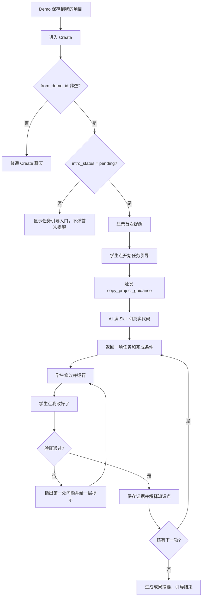

# fineSTEM MVP2 Create 复制项目任务引导：功能与开发说明书

version: v1.1.0
created_at: 2026-08-13 00:00:00.000
updated_at: 2026-08-13 00:00:00.000
maintainer: 产品负责人 / 开发团队
status: 开发输入，待执行（v1.1 已校正主链路落点）

change_log:
  - 2026-08-13 00:00:00.000 根据产品评审补充业务功能、开发落地说明和测试验收标准。
  - 2026-08-13 00:00:00.000 记录 P0-01/P0-02 已修复，P0-03 至 P0-09 进入开发。
  - 2026-08-13 00:00:00.000 冻结边界：不新建项目实验室，不新建视频平台运营数据，不新做数字人和语音。
  - 2026-08-13 00:00:00.000 v1.1 主链路校正：AI 场景生效源是 zeroclaw_provider.SCENE_SYSTEM_PROMPTS（前端经 /agent/scene-prompts 注入 WS），orchestrator.py 仅为回退；教学模式在主链路无独立注入机制，改为在场景 prompt 内嵌；HTML 样板无法用 code_runner，完成验证改为确定性结构检查 + AI 语义复核；补充 MCP 工具数与前端降级同步项。

---

## 0. 文档用途

本文件是 `08_fineSTEM_MVP2_Create_AI导师增强产品说明书_V1.0.md` 的落地补充。开发 Agent 只阅读本文即可理解：

- 这次不是新建一个页面，而是在现有 Create 对话工作台上增加一层复制项目任务引导。
- 需要新增哪些用户可见行为。
- 后端、前端分别改什么。
- 验收标准是什么。
- 哪些事情不能做。

---

## 1. 业务结论

现有主链路继续保留：

```text
Demo 页签
-> 保存到我的项目
-> 项目详情
-> 进入代码编辑器 /create
-> 恢复项目、代码和聊天
-> AI + Skill 协助修改、运行、验证和产出成果
```

MVP2 新增的是很薄的一层：

```text
复制项目第一次进入 Create
-> 显示一次非阻塞提醒
-> 学生主动点击“开始任务引导”
-> AI 先读 Skill 状态和真实代码
-> 每次只给一项任务
-> 学生修改、运行、提交“我改好了”
-> 系统验证是否真的完成
-> 保存证据、解释知识点
-> 再问是否进入下一项
```

所以它不是“进入 Create 后显示一个 5 项任务清单”，而是一次一项的闯关式引导。

---

## 2. 用户可见功能

### 2.1 识别复制项目

只有同时满足以下条件才启用引导：

- 用户已登录并拥有项目。
- `project.from_demo_id` 非空。
- 项目不是本地临时项目。
- 项目 workspace 中有来源 Demo 的真实代码。

学生从零创建的项目不启用。

### 2.2 首次提醒

复制项目第一次进入 Create 后显示：

```text
这是从 Demo 复制来的项目，你可以先运行看看，再完成一次自己的改造。
任务引导会一次只带你做一项修改，并在最后帮你检查是否真的完成。

[开始任务引导] [先自己看看]
以后可以从“任务引导”按钮再次进入。
```

规则：

- 不遮挡整个编辑器。
- 不自动向 AI 发消息。
- “开始任务引导”记录已开始状态并触发引导场景。
- “先自己看看”只关闭提醒，不隐藏后续入口。
- 同一项目换设备或重新登录后不重复弹首次提醒。

### 2.3 再次进入

- 首次提醒关闭后，不重复弹出。
- Create 现有快捷区显示“任务引导”入口。
- 桌面端优先使用快捷区。
- 小屏或快捷区收起时，可使用固定小型图标按钮，并提供文字提示。

### 2.4 AI 一次只给一项任务

学生点击“开始任务引导”后，AI 必须按顺序：

1. 读取项目模式和阶段。
2. 读取当前真实代码文件。
3. 读取来源 Demo 的任务素材。
4. 判断是否已有未完成任务或历史改动。
5. 只给一项任务、一个完成条件和一个下一步动作。

示例回复：

```text
我已经看过这个知识卡项目。我们先完成第一次个性化：
把页面标题和第一张卡片换成你喜欢的内容，然后运行一次。

完成条件：页面能正常打开，并能看到你修改后的标题和卡片。

[带我找到要改的位置] [我先自己试试] [先讲讲数据在哪里]
```

### 2.5 完成验证

学生说“我改好了，请检查”后：

1. AI 重新读取已保存代码。
2. 使用 `code_runner` 或现有预览能力运行。
3. 根据任务完成条件检查结果。
4. 失败时只指出第一处关键问题，并给一层提示。
5. 通过时调用证据工具保存“改了什么、怎样验证”。
6. 用 1 到 3 句话解释对应知识点。
7. 再问是否进入下一项，不自动连续布置任务。

以下情况不能算完成：

- 学生只说“完成了”，但代码没有变化。
- AI 生成了代码，但学生没有运行或检查。
- 页面运行失败。
- 验证标准要求出现新内容，但预览没有出现。
- 学生无法说明自己改了哪里，也没有过程证据。

---

## 3. 首个样板任务

首个古诗/知识卡项目使用 5 项渐进任务：

| 次序 | 学生任务 | 验证 | 对应知识 |
|------|----------|------|----------|
| 1 | 替换标题和第一条内容 | 页面出现新内容 | 字符串、数据与页面 |
| 2 | 增加一条卡片数据 | 页面多出一张卡片 | 数组、重复渲染 |
| 3 | 修改一个交互或样式参数 | 点击或显示结果发生变化 | 事件或条件 |
| 4 | 制造并修复一次小错误 | 重新运行成功 | 报错、AI 协作和核验 |
| 5 | 说明自己的改动 | 形成证据和成果摘要 | 反思与表达 |

这些任务是配置数据，不是写死在 Create UI 中。

---

## 4. 非目标

- 不新建 ProjectLab 页面。
- 不新建视频播放率、完播率、B站账号联动。
- 不新建家长工作台。
- 不新做数字人、AI 朗读、语音输入。
- 不新增收费课程或机构服务。
- 不强制学生从零创建项目使用这条引导。
- 不关闭标准 PBL 门禁来适配复制项目。

---

## 5. 当前代码状态

### 已完成

- `P0-01`：Demo 复制到个人项目时，把来源 Demo 的模板代码和文件写入 workspace。
- `P0-02`：复制 Demo 的 light 项目初始化为 `step_2`，`light_step=2`，并允许 `step_2/step_3` 写代码。
- 后端已有 `project_code_reader`、`code_runner`、`evidence_saver`、`skill_state_reader`。
- 前端 Create 已有编辑器、聊天、QuestionCard、运行和保存能力。

### 尚未完成

- `P0-03`：workspace 响应还不返回复制项目引导状态。
- `P0-04`：Create 还没有首次提醒和“任务引导”入口。
- `P0-05`：后端还没有 `copy_project_guidance` 场景。
- `P0-06`：引导场景还没有显式复用四种教学模式。
- `P0-07`：还没有复制项目的完成验证工具或流程。
- `P0-08`：还没有首个 Demo 的 5 项任务配置。
- `P0-09`：还没有覆盖这些行为的自动化测试。

### 5.1 AI 主链路与场景落点（关键现状，决定 6.2 / 6.3 / 6.4 写法）

代码审计后确认，当前 AI 对话有两条链路，开发前必须分清，否则会出现“单测通过但线上不生效”：

```text
主链路（生产实际走这条）：
  前端 Create.tsx
  -> useStreamingChat 直连 ZeroClaw WebSocket（ws://127.0.0.1:42617/ws/chat）
  -> 前端从 GET /api/v1/agent/scene-prompts 拉场景提示词
  -> 拼进 WS 消息文本的 <scene_instructions> 块
  -> daemon 读消息文本 + 调用 MCP 工具（tools.py 的 TOOL_REGISTRY）

回退链路（REST / 后端 WS，基本不再走）：
  POST /agent/chat | /agent/stream | /agent/ws
  -> AgentOrchestratorService（orchestrator.py，文件头已标注 DEPRECATED）
```

由此得出四个硬事实，本说明书后续章节都基于它们：

1. **场景提示词的生效源是 `apps/backend/app/services/providers/zeroclaw_provider.py:66` 的 `SCENE_SYSTEM_PROMPTS`**。它通过 `app/api/agent.py:143` 的 `GET /agent/scene-prompts` 暴露给前端，前端 `apps/frontend/src/lib/scenePrompts.ts` 拉取并缓存，由 `useStreamingChat` 注入 WS。`orchestrator.py` 的 `_build_scene_instruction` 只服务回退链路。**P0-05 必须主链路、回退两处都加，且以主链路为准。**

2. **主链路没有独立的“教学模式注入”机制**。`orchestrator.py:202` 的 `_build_teaching_mode_instruction` 写死了 `stage_07/stage_08` 才注入教学模式指引，复制项目是 light 模式 `step_2/step_3`，命中不了；而且这条逻辑根本不在主链路上。因此 P0-06“复用四种教学模式”只能在 `copy_project_guidance` 场景 prompt 里**内嵌**四种模式指引，不能依赖 `_build_teaching_mode_instruction`。

3. **MCP 工具源是 `app/mcp_server/server.py` 的 `_load_tools()`，底层来自 `tools.py` 的 `TOOL_REGISTRY`**。ZeroClaw daemon 通过 MCP 协议调用工具。新增 `copy_guidance_verifier` 注册到 `TOOL_REGISTRY` 后会自动暴露给 daemon，但 `tests/test_mcp_server.py:31-46` 对工具数量（`== 16`）和名称集合做了精确断言，**必须同步更新为 17 与新名称集合**，否则 CI 红。

4. **HTML 样板无法用 `code_runner`**。`code_runner` 只支持 python/javascript，而首个样板 `demo_poetry_card` 是单文件 HTML。P0-07“运行验证”对 HTML 只能做结构完整性检查（标签/括号配对、关键元素存在），真正的“页面是否出现新内容”这类语义判定由 AI 在场景指令下复核。详见 6.4。

---

## 6. 后端开发说明

### 6.1 引导状态

不新增表。在现有 `SkillState.metadata` 中增加：

```json
{
  "copy_guidance": {
    "version": "1.0",
    "intro_status": "pending | dismissed | started",
    "session_status": "idle | active | waiting_verify | completed",
    "current_task": {
      "id": "replace_first_card",
      "title": "替换标题和第一张卡片",
      "acceptance_checks": ["code_changed", "run_success"]
    },
    "started_at": "2026-08-13T00:00:00Z",
    "updated_at": "2026-08-13T00:00:00Z"
  }
}
```

建议实现点：

- 在 `apps/backend/app/api/projects.py` 的 `_build_workspace_payload` 中读取该节点（参考现有 `_get_teaching_mode_from_state` 的 metadata 解包写法，兼容 metadata 为 str/dict）。
- 在 `apps/backend/app/schemas/projects.py` 的 `ProjectProgress` 中增加 `copy_guidance: Optional[Dict[str, Any]] = None`。
- **初始化**：在 `create_project` 端点里，当 `from_demo_id` 非空时，创建项目后写入初始 `copy_guidance`（`intro_status="pending"`、`session_status="idle"`、`version="1.0"`）。自建项目不写，保持 `None`。
- **状态读写建议抽到 `apps/backend/app/services/copy_guidance_state.py`**（纯函数）：`get_copy_guidance(skill_state)`、`init_copy_guidance(...)`、`update_copy_guidance(skill_state, patch)`。
- **状态流转校验**：`intro_status` 只允许 `pending → dismissed | started`（不允许回退）；`session_status` 按 `idle → active → waiting_verify → completed` 推进。非法流转返回 400。
- **统一更新端点**：新增 `POST /api/v1/projects/{project_id}/copy-guidance`（仿现有 `update_project_teaching_mode`，约 projects.py:906）：鉴权后写 `metadata.copy_guidance`，返回最新 `ProjectProgress`。请求体 `CopyGuidanceUpdate` 接受 `intro_status` / `session_status` / `current_task` 任意子集。
- 保持缺失字段时返回 `None`，保证旧项目兼容。

### 6.2 新增 AI 场景（双链路，主链路为准）

依据 5.1，场景提示词必须在**主链路**和**回退链路**两处都加，内容保持一致：

| 链路 | 文件 | 改动点 |
|------|------|--------|
| 主链路（生产） | `apps/backend/app/services/providers/zeroclaw_provider.py` | 在 `SCENE_SYSTEM_PROMPTS`（约行 66）新增 `"copy_project_guidance"` 键 |
| 回退链路 | `apps/backend/app/services/orchestrator.py` | 在 `_build_scene_instruction`（约行 245）新增 `elif scene == "copy_project_guidance"` 分支 |

为避免两处分叉，建议把场景指令文本抽成一个公共常量（例如 `app/services/copy_guidance_scene.py` 里的 `COPY_PROJECT_GUIDANCE_PROMPT`），主链路和回退链路都引用它。

场景指令必须包含：

```text
- 先调用 skill_state_reader 读取 mode、current_stage、teaching_mode、metadata（含 copy_guidance 节点）。
- 再调用 project_code_reader 读取真实文件，不要凭项目名猜代码。
- 读取来源 Demo 的 fork-template 或任务配置（copy_guidance_tasks）。
- 根据 metadata.copy_guidance.current_task 判断当前要做的任务；若无 current_task 则从首项开始。
- 一次只返回一项任务，并给出该任务的完成条件和一个下一步动作。
- 布置任务后用 ask_question 给出选项卡（如“带我找到要改的位置 / 我先自己试试 / 先讲讲数据在哪里”）。
- 学生点“我改好了，请检查”或明确表示完成后，调用 copy_guidance_verifier 验证，不要凭学生一句话就判定通过。
- 验证通过：用 1-3 句话解释对应知识点，调用 evidence_saver 保存证据，再询问是否进入下一项，不自动连续布置。
- 验证失败：只指出第一处关键问题，并给一层提示。
- 不允许一次给出完整答案（除非学生明确索要或多次失败）。
- 学生没有主动要求时，不得调用 stage_advancer。
- 不得绕过标准 PBL 门禁。
```

> 注意：主链路 prompt 拼接在 `STEM_SYSTEM_PROMPT` 之后（参考 `zeroclaw_provider.py` 现有 `"问问题"`/`"解释代码"` 等键的写法）。`STEM_SYSTEM_PROMPT` 已含通用提问 XML 格式与可见性规则，无需重复。

### 6.3 教学模式复用（在场景 prompt 内嵌）

依据 5.1 事实 2：主链路没有独立的教学模式注入机制，`orchestrator._build_teaching_mode_instruction` 只在 `stage_07/08` 生效，复制项目（step_2/step_3）命中不了，且这条逻辑不在主链路上。

因此**不要**去改 `_build_teaching_mode_instruction`（那会影响 standard 项目现有行为），而是把四种教学模式的行为指引**直接内嵌进 `copy_project_guidance` 场景 prompt**，并要求 AI 先用 `skill_state_reader` 读 `metadata.teachingMode`，再套用对应模式。这是主链路和回退链路都生效的唯一可靠做法。

内嵌写法（加在 6.2 场景指令末尾）：

```text
## 教学模式（先读再套用）
- 先用 skill_state_reader 读取 metadata.teachingMode（缺省视为 guided）。
- 根据读到的模式调整本轮引导方式，不要新增第五种模式：
  - guided（引导式）：指出要改的文件和位置，给骨架或 TODO，让学生补关键内容。
  - demo（演示式）：先展示一次完整改法，再让学生换成自己的内容。
  - hands_on（动手式）：只给任务、完成条件和提示，默认不交付完整答案。
  - lecture（讲解式）：先解释数据、变量或算法，再让学生修改当前项目。
- 复制项目的首次改造默认偏 hands_on，但仍以学生已持久化的 teachingMode 为准。
```

不要新增第五种教学模式，也不要为复制项目单独建一套导师模式。

### 6.4 完成验证工具（确定性结构检查 + AI 语义复核）

依据 5.1 事实 4：`code_runner` 只支持 python/javascript，首个样板 `demo_poetry_card` 是 HTML，无法“真正运行”。因此完成验证分两层，**不要假装能对 HTML 真实运行**：

```text
第一层（工具，确定性）：copy_guidance_verifier
  - 读当前 workspace 代码（project_code_reader 逻辑）
  - 读来源 Demo 的 minimal_replica 做对比（db.get_project 拿 from_demo_id -> db.get_demo）
  - 按任务的 acceptance_checks 做确定性检查（见下表）
  - 通过则调 evidence_saver 保存证据
  - 返回结构化结果（含每项检查的通过/失败与原始数据）

第二层（AI，语义复核）：copy_project_guidance 场景指令
  - 收到 verifier 的结果后，结合学生 claimed_changes 和对话上下文做最终语义判断
  - 若 auto_passed=true 且语义也吻合 -> 确认通过、解释知识点、询问下一项
  - 若 auto_passed=false -> 读 first_issue 给学生一层提示
  - 若 auto_passed=true 但语义不吻合（如学生没真改）-> 追问或判定未完成
```

**通用 acceptance check 类型**（验证器按类型分发，与具体 Demo 解耦，第二个 Demo 只加任务配置不改验证器）：

| check 类型 | 确定性判定方式 | 适用任务示例 |
|-----------|---------------|-------------|
| `code_changed` | 当前代码归一化 hash ≠ 来源 Demo minimal_replica 归一化 hash（去空白后比较） | replace_first_card、modify_interaction |
| `run_success` | python/javascript：调 `code_runner` 看 exit_code==0；HTML：检查 `<html`/`</html>` 配对、JS 括号配对、无未闭合标签的结构完整性 | 所有需运行的任务 |
| `content_keyword` | 从 `claimed_changes` 提取关键词，在当前代码中命中（用于近似判断“是否换成了自己的内容”） | replace_first_card |
| `card_count` | 正则统计卡片数据/DOM 节点数量，要求比初始 Demo 多（或满足阈值） | add_card_data |

> 说明：`content_keyword` / `card_count` 是近似检查，不能 100% 判定语义正确。这正是需要第二层 AI 复核的原因。验证器对无法确定性判断的项返回原始数据，交由 AI 在场景指令下判断。

输入：

```json
{
  "project_id": "项目ID",
  "task_id": "replace_first_card",
  "claimed_changes": "学生说改了什么"
}
```

通过时输出：

```json
{
  "auto_passed": true,
  "passed": true,
  "evidence_saved": true,
  "knowledge_point": "字符串、数据与页面",
  "next_task_id": "add_card_data",
  "checks_detail": [
    {"check": "code_changed", "passed": true},
    {"check": "run_success", "passed": true, "note": "html 结构完整"},
    {"check": "content_keyword", "passed": true, "matched": ["我的标题"]}
  ]
}
```

失败时输出（只报第一处关键问题 + 一层提示）：

```json
{
  "auto_passed": false,
  "passed": false,
  "first_issue": "代码与原始 Demo 完全一致，没有检测到改动",
  "next_hint": "先在 index.html 里把页面标题改成你自己的内容",
  "checks_detail": [{"check": "code_changed", "passed": false}]
}
```

> `passed` 字段：当所有确定性 check 通过时为 true；任一失败为 false。AI 仍可在 `passed=true` 时根据语义复核推翻（极少见），但默认以 verifier 结果为准。这样既保证可测试、可复现，又保留 AI 对语义的最终把关。

### 6.5 首个任务配置（通用 check 类型，与 Demo 解耦）

配置放在独立 Python 模块：

```text
apps/backend/app/services/copy_guidance_tasks.py
```

提供三个函数：`get_tasks_for_demo(demo_id)`、`get_task(task_id)`、`get_next_task(current_task_id)`。`acceptance_checks` 必须使用 6.4 定义的通用类型（`code_changed`/`run_success`/`content_keyword`/`card_count`），这样验证器不用为每个 Demo 写专门逻辑。

首个样板（`demo_poetry_card`，已存在于 `demo_repo.py`）的 5 项任务：

```json
[
  {
    "id": "replace_first_card",
    "title": "替换标题和第一张卡片",
    "acceptance_checks": ["code_changed", "run_success", "content_keyword"],
    "knowledge_point": "字符串、数据与页面",
    "hint": "在 index.html 里找到页面标题和第一张卡片的位置",
    "demo_ids": ["demo_poetry_card"]
  },
  {
    "id": "add_card_data",
    "title": "增加一条卡片数据",
    "acceptance_checks": ["code_changed", "card_count"],
    "knowledge_point": "数组、重复渲染",
    "hint": "找到 data 数组，照着已有条目加一条",
    "demo_ids": ["demo_poetry_card"]
  },
  {
    "id": "modify_interaction",
    "title": "修改一个交互或样式参数",
    "acceptance_checks": ["code_changed", "run_success"],
    "knowledge_point": "事件或条件",
    "hint": "改一个颜色、过滤条件或点击行为",
    "demo_ids": ["demo_poetry_card"]
  },
  {
    "id": "fix_error",
    "title": "制造并修复一次小错误",
    "acceptance_checks": ["code_changed", "run_success"],
    "knowledge_point": "报错、AI 协作和核验",
    "hint": "故意删一个引号或括号，看报错，再修回来",
    "demo_ids": ["demo_poetry_card"]
  },
  {
    "id": "explain_changes",
    "title": "说明自己的改动",
    "acceptance_checks": ["code_changed"],
    "knowledge_point": "反思与表达",
    "hint": "用一句话说出你改了哪一处、为什么",
    "demo_ids": ["demo_poetry_card"]
  }
]
```

第二个 Demo 复用方式：在 `copy_guidance_tasks.py` 增加一条任务配置（`demo_ids` 指向新 Demo），验证器无需改动。这是 P1-04“证明引导机制不是古诗项目硬编码”的验收前提。

---

## 7. 前端开发说明

主要改动在 `apps/frontend/src/pages/Create.tsx`。

### 7.1 workspace 恢复后判断

在 `applyWorkspaceRestore` 完成后：

```text
project.from_demo_id 非空
且 progress.copy_guidance.intro_status === 'pending'
```

才显示首次提醒。

### 7.2 首次提醒交互

- 不自动调用聊天接口。
- “开始任务引导”需要把 `intro_status` 标记为 `started`。
- “先自己看看”需要把 `intro_status` 标记为 `dismissed`。
- 标记成功后触发 `copy_project_guidance` 场景。
- 标记失败时保持当前状态，不重复弹窗。

### 7.3 快捷区入口

- 在 Create 现有快捷操作区域增加“任务引导”按钮。
- 有 `copy_guidance.current_task` 时，按钮文案可显示“继续任务”或当前任务名。
- 小屏快捷区收起时，使用一个固定的小型图标按钮，并提供 tooltip。

### 7.4 状态更新

- 前端从 workspace 响应恢复 `copy_guidance`。
- 后端更新状态后，前端局部更新，不必整页刷新。
- 不创建新的全局 Redux 或全局 store，优先沿用 Create 现有 projectContext。

---

## 8. 核心流程



---

## 9. 测试验收

### 9.1 功能验收用例

| 编号 | 场景 | 预期 |
|------|------|------|
| AC-01 | 保存古诗/知识卡 Demo 后进入 Create | workspace 包含来源 Demo 真实代码，current_stage 为 `step_2` |
| AC-02 | 从零创建 light 项目进入 Create | 不显示复制项目首次提醒，也不显示任务引导入口 |
| AC-03 | 第一次进入复制项目 | 显示一次首次提醒，且不自动向 AI 发消息 |
| AC-04 | 点“先自己看看” | 提醒关闭，后续仍可从快捷区进入任务引导 |
| AC-05 | 刷新或换设备重新进入同一复制项目 | 不重复显示首次提醒 |
| AC-06 | 点“开始任务引导” | AI 先读 Skill 和代码，再返回一项任务，不一次给多个任务 |
| AC-07 | 学生未改代码就说“我改好了” | 验证失败，不能保存通过证据 |
| AC-08 | 学生改错位置 | AI 指出第一处关键问题，并只给一层提示 |
| AC-09 | 学生正确修改并运行 | 验证通过，保存证据，解释一个知识点 |
| AC-10 | 第一项通过后 | 再询问是否进入下一项，不自动连续布置 |
| AC-11 | 切换四种教学模式 | 引导场景遵守对应教学模式 |
| AC-12 | 复制项目未完成任何任务 | 下次进入可继续当前任务 |
| AC-13 | 标准 PBL 项目 | 9 阶段门禁、项目恢复、聊天、运行和成果卡无回归 |
| AC-14 | 本地临时项目 | 不显示任务引导入口，不写入引导状态 |

### 9.2 后端自动化测试

建议新增或扩展：

- `tests/test_copy_guidance_state.py`
- `tests/test_copy_guidance_scene.py`
- `tests/test_copy_guidance_verifier.py`
- `tests/test_projects.py`
- **`tests/test_mcp_server.py`（必需维护）**：新增 `copy_guidance_verifier` 后，`_load_tools()` 返回 17 个工具，必须把 `test_loads_all_16_tools` 的 `== 16` 改为 `== 17`、`test_tools_list_returns_all_specs` 的 `len == 16` 改为 17、并把 `test_expected_tool_names_present` 的 `expected` 集合补上 `"copy_guidance_verifier"`。这是硬编码断言，不改 CI 必红。

覆盖点：

- 复制项目 workspace 代码完整。
- 自建项目无 `copy_guidance` 或 `copy_guidance=None`。
- 复制项目创建后 `copy_guidance.intro_status == "pending"`。
- `intro_status` 只能按 `pending -> dismissed/started` 状态流转，非法流转返回 400。
- `copy_project_guidance` 场景：主链路 `SCENE_SYSTEM_PROMPTS` 含新键且内容含工具调用顺序约束；回退链路 `_build_scene_instruction` 含对应分支；两处文本一致。
- 验证器通过/失败/证据保存三条路径；HTML 结构完整性检查（`run_success` 对 HTML 走结构检查而非 code_runner）；`code_changed` 用 hash 对比来源 Demo；`content_keyword`/`card_count` 近似命中。
- `step_2/step_3` 代码权限和标准 PBL 门禁不冲突（沿用 `test_stage_constants.py` 已有断言，不改数量）。

### 9.3 前端测试

- 首次提醒只渲染一次。
- 自建项目不渲染提醒。
- 点击按钮后没有自动调用聊天接口。
- 快捷区入口可见。
- 小屏下入口不遮挡编辑器。
- **`apps/frontend/src/lib/scenePrompts.ts` 的 `FALLBACK_PROMPTS` 需补 `copy_project_guidance` 精简版**：后端 `/agent/scene-prompts` 不可达时仍有场景约束，否则降级链路下引导场景提示词为空。
- 判定逻辑（如 `shouldShowCopyGuidanceIntro(project, progress)`）抽成纯函数，用 vitest 覆盖；渲染行为用现有 Playwright e2e（`tests/specs/`）补充，不引入新的渲染测试依赖。

---

## 10. 完成定义

全部满足才算 P0-03 至 P0-09 完成：

- [ ] 复制项目 workspace 返回 `copy_guidance`，且创建时 `intro_status` 初始化为 `pending`。
- [ ] `POST /projects/{id}/copy-guidance` 端点可用，状态流转受校验。
- [ ] 复制项目首次进入 Create 显示提醒，且不自动发 AI 消息。
- [ ] 自建项目不显示提醒和入口。
- [ ] Create 快捷区可再次进入任务引导。
- [ ] `copy_project_guidance` 场景已在**主链路**（`zeroclaw_provider.SCENE_SYSTEM_PROMPTS`）和回退链路（`orchestrator._build_scene_instruction`）两处添加，且先读 Skill 和代码，再给一项任务。
- [ ] 完成验证：确定性结构检查（含 HTML 结构完整性）+ AI 语义复核，通过后保存证据。
- [ ] 首个样板有 5 项任务配置，acceptance check 使用通用类型。
- [ ] 四种教学模式在场景 prompt 内嵌生效（不新增第五种）。
- [ ] `test_mcp_server.py` 工具数断言已更新为 17；前端 `FALLBACK_PROMPTS` 已补 copy 场景。
- [ ] 自动化测试通过，标准 PBL 和 Create 主链路无回归。
- [ ] 没有新增 ProjectLab、视频运营后台、数字人或语音代码。

---

## 11. 已知基线

当前开发 Agent 跑完整测试时，可能看到 `TestPBLFullLoop` 的两个失败：

```text
expected stage_08_evaluate
got stage_07_execute
```

这是既有 Q-013 测试夹具未设置 `teachingMode` / `teachingModeConfirmed`，不是本任务引入。开发本任务时不要顺手修改这个测试，除非该测试与当前改动发生真实冲突。