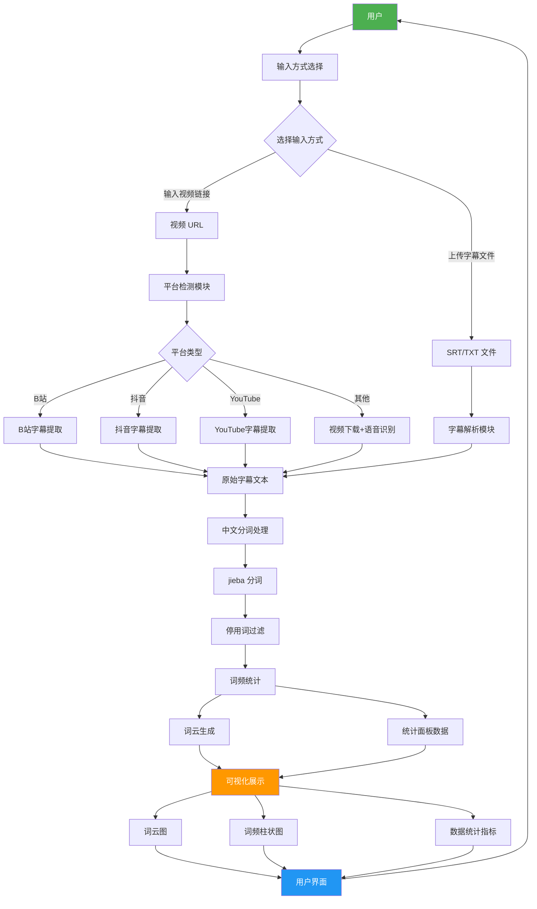
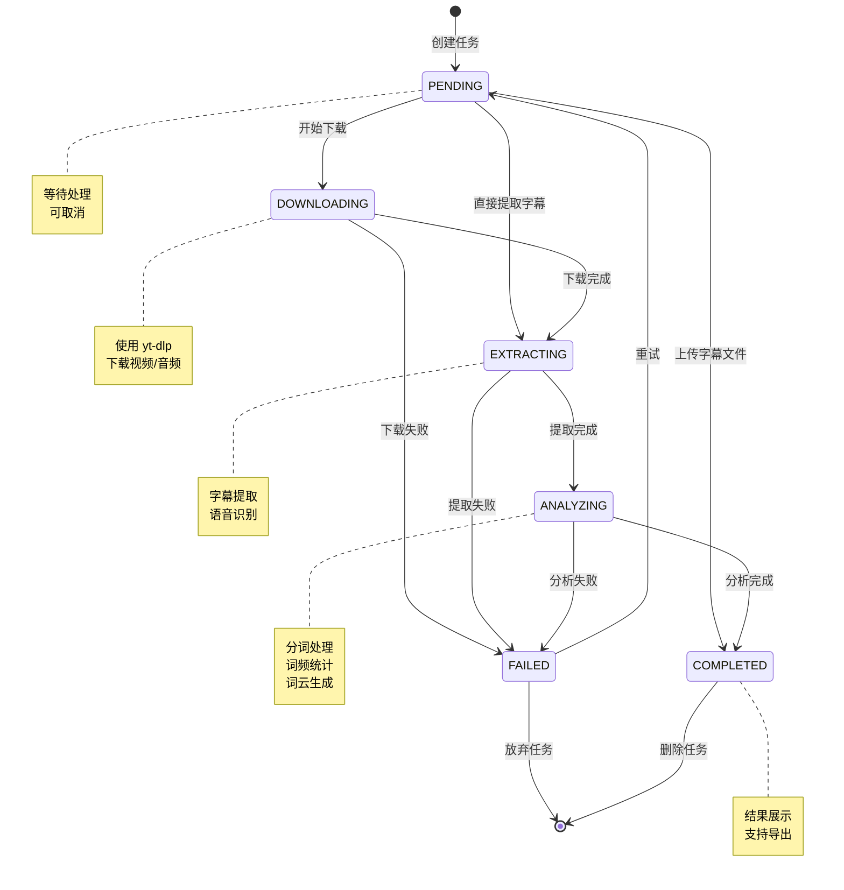
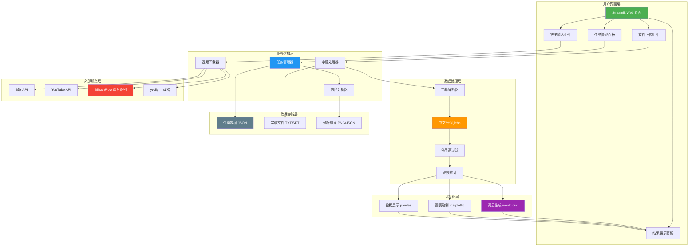
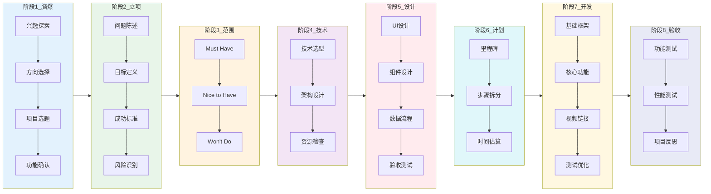
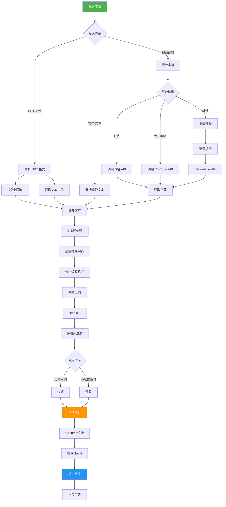
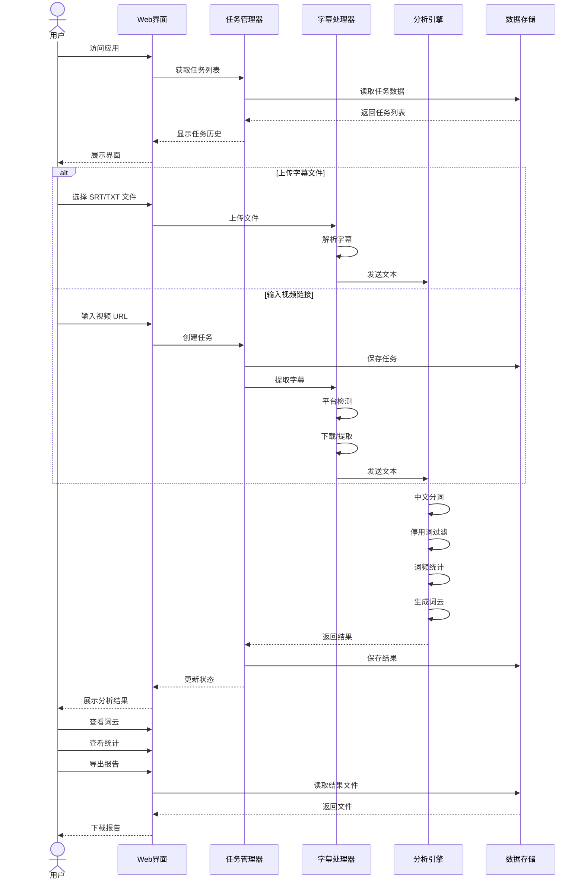
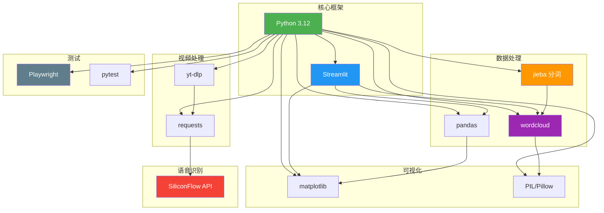

# 项目流程图

> 项目: UP 主视频内容分析器  
> 创建时间: 2026-03-18  
> 文档版本: v1.0.0

---

## 1. 系统数据流程图

---

## 2. 任务状态流转图

---

## 3. 系统架构图

---

## 4. 项目开发流程图

---

## 5. 字幕处理流程图

---

## 6. 用户交互流程图

---

## 7. 项目里程碑时间线

```mermaid
gantt
    title UP 主视频内容分析器 - 开发时间线
    dateFormat  HH:mm
    axisFormat %H:%M
    
    section 阶段1-脑爆
    兴趣探索           :done, a1, 00:00, 10m
    方向选择           :done, a2, after a1, 10m
    项目选题           :done, a3, after a2, 15m
    功能确认           :done, a4, after a3, 15m
    
    section 阶段2-立项
    问题陈述           :done, b1, after a4, 10m
    目标定义           :done, b2, after b1, 10m
    成功标准           :done, b3, after b2, 10m
    风险识别           :done, b4, after b3, 10m
    
    section 阶段3-范围
    Must Have          :done, c1, after b4, 15m
    Nice to Have       :done, c2, after c1, 10m
    Won't Do           :done, c3, after c2, 10m
    
    section 阶段4-技术
    技术选型           :done, d1, after c3, 15m
    架构设计           :done, d2, after d1, 15m
    资源检查           :done, d3, after d2, 10m
    
    section 阶段5-设计
    UI设计             :done, e1, after d3, 20m
    组件设计           :done, e2, after e1, 15m
    数据流程           :done, e3, after e2, 15m
    验收测试           :done, e4, after e3, 10m
    
    section 阶段6-计划
    里程碑划分         :done, f1, after e4, 15m
    步骤拆分           :done, f2, after f1, 15m
    时间估算           :done, f3, after f2, 10m
    
    section 阶段7-开发
    基础框架           :done, g1, after f3, 1h
    字幕处理           :done, g2, after g1, 1.5h
    可视化             :done, g3, after g2, 1.5h
    视频链接           :done, g4, after g3, 1.5h
    测试优化           :done, g5, after g4, 30m
    
    section 阶段8-验收
    功能测试           :done, h1, after g5, 20m
    性能测试           :done, h2, after h1, 15m
    项目反思           :done, h3, after h2, 15m
```

---

## 8. 技术栈依赖图

---

## 使用说明

本文档使用 Mermaid 语法绘制流程图，可在以下工具中查看：

1. **VS Code**: 安装 Mermaid 插件
2. **在线编辑器**: [Mermaid Live Editor](https://mermaid.live/)
3. **Markdown 查看器**: 支持 Mermaid 的 Markdown 渲染器

---

*文档生成时间: 2026-03-18*  
*关联工件: docs/04_design.json, docs/05_step_plan.json*
